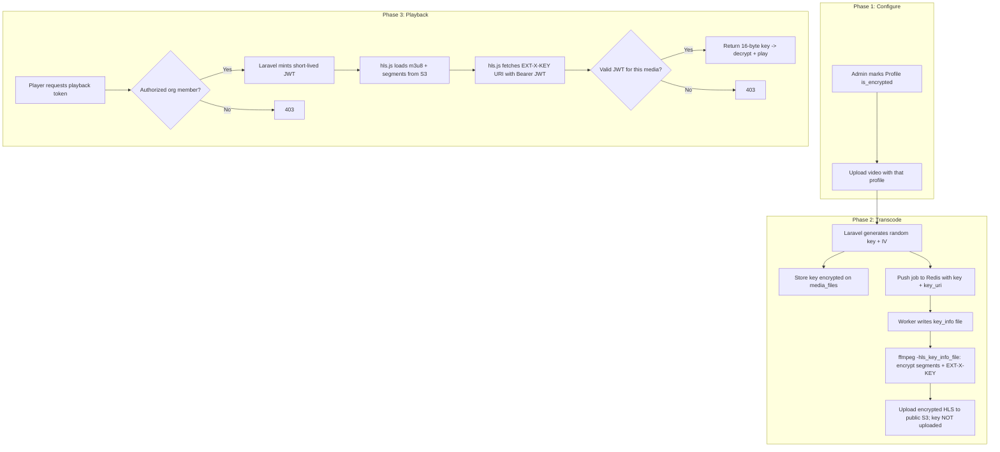
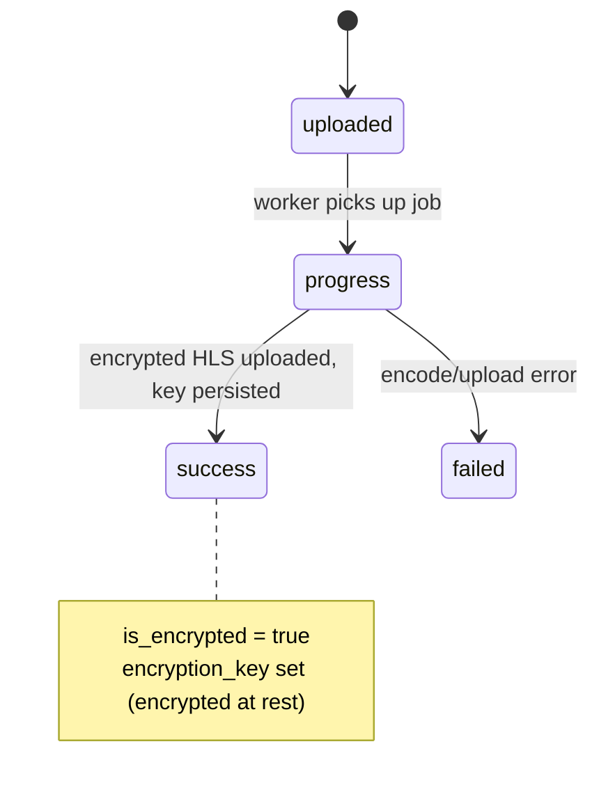
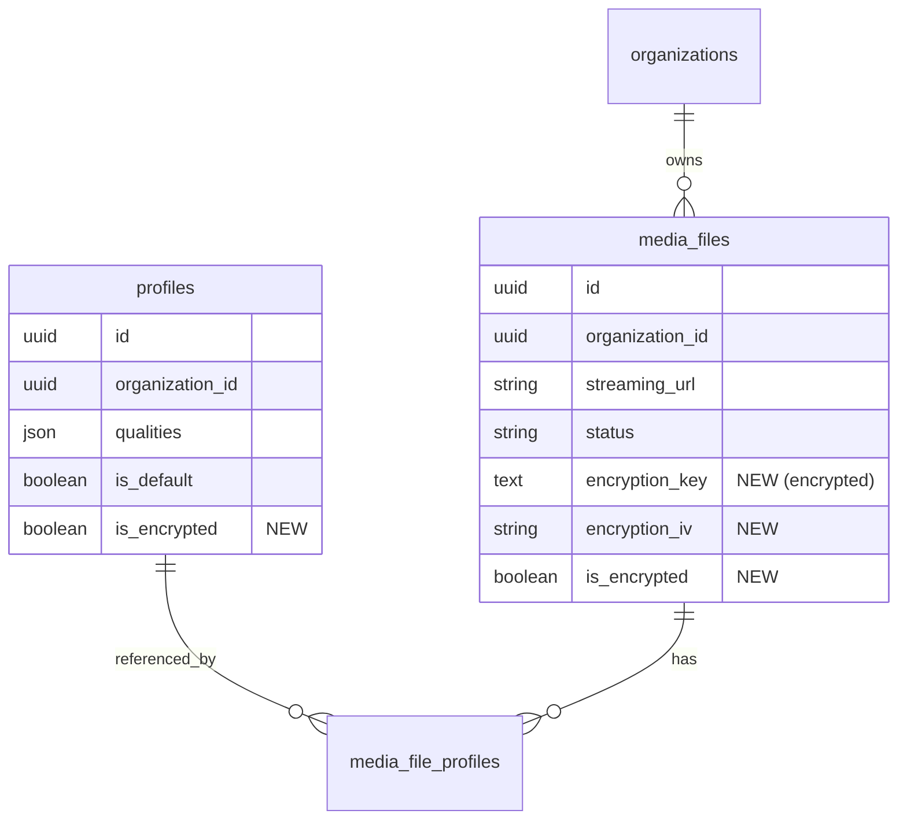
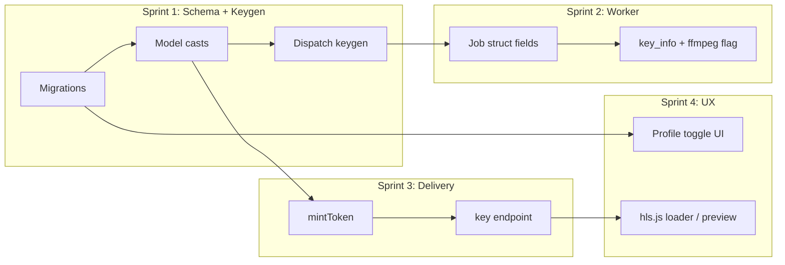

# AES-128 HLS Encryption for VOD

**Status**: Draft
**Complexity**: Medium
**Created**: June 24, 2026
**Author**: saturngod
**PRD ID**: PRD-2026-06-24-1714

---

## 1. Summary

Oxygen serves transcoded VOD as **unencrypted** HLS from a **public** S3 bucket, so anyone with the `streaming_url` can play or scrape the segments. This PRD adds standards-based **HLS AES-128 encryption** (RFC 8216) where each video gets its own random 16-byte key, and the key is delivered only to authenticated players via a short-lived JWT. It serves organizations that need to stop casual download, hotlinking, and scraping of their content without paying for DRM, and it gives the platform a per-key audit trail of every decryption request.

---

## 2. Problem

Today the Go transcode worker (`golang-queue`) writes plaintext MPEG-TS HLS to a public streaming bucket and stores a direct public URL in `media_files.streaming_url`. Any person who obtains that URL — or guesses the `hls/{org}/{media}/` path — can download every `.ts` segment and reassemble the full video. There is no key, no token, and no per-request authorization on playback. Customers who upload paid or private content have no way to restrict who can actually watch.

The cost of inaction is direct: content leaks, hotlinking inflates bandwidth bills on someone else's behalf, and the platform cannot offer "protected video" as a feature to organizations that need it. Competing platforms offer at least token-gated or encrypted HLS; without it, Oxygen cannot serve customers with any confidentiality requirement, and every public segment URL is a standing liability.

---

## 3. Solution

Build encrypted VOD on three pillars:

1. **Per-file AES-128 encryption** — ffmpeg encrypts every segment in the existing single invocation via `-hls_key_info_file`; each media file has its own random key + IV.
2. **JWT-gated key delivery** — the playlist's `EXT-X-KEY` URI points to a Laravel endpoint that returns the raw key only when presented a valid short-lived JWT in the `Authorization` header.
3. **Per-profile opt-in** — a `Profile.is_encrypted` flag lets organizations choose which videos are protected, keeping all existing content and the default path unchanged.

---

## 4. Objectives Table

| # | Objective | Success Metric |
|---|-----------|---------------|
| O1 | Encrypt VOD output per file | Every segment of an encrypted file is AES-128 encrypted; raw `.ts` from S3 is unplayable without the key (boolean) |
| O2 | Gate key behind auth | `GET /media/{id}/key` returns 403 without a valid JWT; 200 + 16 bytes with one (boolean) |
| O3 | Keep encryption opt-in | Existing unencrypted videos and non-encrypted profiles behave identically post-deploy (boolean) |
| O4 | Standards compliance | Encrypted streams play in hls.js with zero custom decryption code (boolean) |
| O5 | No pipeline regression | Encryption adds 0 extra ffmpeg invocations; single-pass transcode preserved (boolean) |

---

## 5. Scope

### In Scope

**Database**
- `media_files.encryption_key` (text, nullable, Laravel `encrypted` cast) — raw 16-byte key, encrypted at rest.
- `media_files.encryption_iv` (string, nullable) — non-secret IV (also appears in the playlist).
- `media_files.is_encrypted` (boolean, default `false`).
- `profiles.is_encrypted` (boolean, default `false`).

**Backend — key generation & dispatch**
- In `ManageController::dispatchTranscodeJob`, when the resolved profile has `is_encrypted = true`: generate `random_bytes(16)` key + IV, persist to the `MediaFile`, and add `encrypt`, `encryption_key` (hex), `encryption_iv` (hex), `key_uri` to the Redis job payload.

**Backend — key delivery**
- `MediaKeyController::mintToken` — `POST /media/{mediaFile}/token`, session + `EnsureOrganizationMember`, returns a short-lived JWT.
- `MediaKeyController::key` — `GET /media/{mediaFile}/key`, token-authenticated (no session), returns raw 16 bytes as `application/octet-stream` with `Cache-Control: no-store` + CORS.

**Worker — `golang-queue`**
- Extend `Job` struct with `Encrypt`, `EncryptionKey`, `EncryptionIV`, `KeyURI`.
- When `Encrypt`, write a key_info file **outside** the uploaded HLS tree and append `-hls_key_info_file` to ffmpeg args.

**Profiles UI**
- `is_encrypted` checkbox in `resources/js/pages/admin/profiles/` create/edit forms.

**Frontend reference**
- Documented hls.js `xhrSetup` snippet attaching the JWT as `Authorization: Bearer` on the key request.

### Out of Scope

- Live streaming encryption (`golang-live`, fMP4/CMAF — needs SAMPLE-AES, unsupported by gohlslib).
- True DRM (Widevine / FairPlay / PlayReady).
- Signing or proxying playlist/segment URLs (segments stay on public S3; encryption is the control).
- iOS Safari native-HLS playback (`<video src>` cannot send custom headers).
- Re-encrypting already-transcoded content.
- Per-segment or rotating keys.

### Deferred to Post-MVP

| Feature | Reason | Phase |
|---------|--------|-------|
| Live stream encryption | fMP4 requires SAMPLE-AES; library support missing | v2 |
| Signed key URL fallback for iOS Safari | Header-auth covers MSE players first | v2 |
| Signed/proxied segment + playlist URLs | Encryption alone meets MVP threat model | v2 |
| Per-viewer key binding + abuse detection | Needs analytics + rate-limit infra | v3 |

### Implementation Notes

- The IV is stored as plaintext because it is non-secret and already published in the `EXT-X-KEY` tag; only `encryption_key` uses the `encrypted` cast.
- This change does **not** touch `App\Enums\VideoQuality`, so the four-way enum mirror rule (PHP / JS / golang-queue / golang-live) does not apply.
- The key is generated in Laravel (not the worker) so the `encrypted` cast and `APP_KEY` remain the single source of key-at-rest protection; the worker only consumes the key for the encode.

### Target Users

| Role | Impact |
|------|--------|
| Organization Admin | Can mark a coding profile as encrypted; videos transcoded with it are protected. |
| Viewer (via embedding app) | Plays protected video through hls.js once their app supplies a valid token. |
| Platform operator | Gains a per-request audit log of key access; public segment URLs no longer leak content. |

---

## 6. Architecture

### Business Flow



### State Machine

Encryption rides on the existing `MediaFileStatus` lifecycle; no new states.



### Role / Permission Approach

No new roles. Token minting reuses `EnsureOrganizationMember` and re-checks `organization_id` against `session('current_organization_id')`. The `key` endpoint is **unauthenticated by session** and instead validated by JWT — mirroring the existing `/internal/live/*` shared-token pattern, but per-request and per-media rather than a global service token. Marking a profile encrypted stays under the existing `EnsureOrganizationAdmin` profile routes.

### Key & Token Model

- **Key (secret):** 16 random bytes, generated once per media file, stored `encrypted` on `media_files`, served only over the JWT-gated endpoint, never written to S3.
- **IV (non-secret):** 16 bytes, stored plaintext, also embedded in the playlist `EXT-X-KEY` tag.
- **JWT (short-lived):** signed with `services.media.jwt_secret`, claims `{ media_file_id, org_id, exp }`, TTL ~10 min. Sent only as an `Authorization` header so it cannot be pasted into a browser URL or hotlinked.

### Database Entity Relationship



### Feature Dependency Graph



---

## 7. Codebase Baseline

| Asset | Current State | Change |
|-------|--------------|--------|
| `MediaFile` model | Has `streaming_url`, `status`, `organization_id`; no key fields | Add `encryption_key`/`encryption_iv`/`is_encrypted` + casts |
| `Profile` model | `qualities`, `is_default` | Add `is_encrypted` |
| `ManageController::dispatchTranscodeJob` | LPUSHes plaintext job JSON to Redis | Generate + attach key/IV/key_uri when profile encrypted |
| `golang-queue` `transcode/transcoder.go` | Single ffmpeg call with HLS args (~152-172) | Conditionally append `-hls_key_info_file` |
| `golang-queue` `queue/consumer.go` | `Job` struct (~18-32); pipeline (~194-212) | Add fields; write key_info when `Encrypt` |
| `golang-queue` `s3/client.go` | `UploadHLS` walks `outputDir`; public URL | Verify key file lives outside `outputDir` so it is never uploaded |
| Streaming S3 bucket | Public, unencrypted segments | Unchanged (segments now encrypted) |
| Auth | Session + `X-Live-Service-Token` only; no JWT | Introduce JWT for key delivery |

**Risk flag:** the worker's `UploadHLS` recursively walks the HLS dir — the key file MUST be written outside that dir, or the secret leaks to public S3. This is the single highest-risk task.

---

## 8. Technical Design

### New Tables

None.

### Modified Tables

| Table | Column changes | Migration notes |
|-------|----------------|-----------------|
| `media_files` | `+ encryption_key text null`, `+ encryption_iv string null`, `+ is_encrypted bool default false` | One migration; `encryption_key` read via `encrypted` cast |
| `profiles` | `+ is_encrypted bool default false` | Separate migration |

### Critical Filtering / Isolation Logic

The `key` endpoint must enforce media↔token binding to prevent one org's token unlocking another file:

```php
// MediaKeyController::key
$claims = $this->verifyJwt($request->bearerToken()); // throws/403 on bad sig or expiry
abort_unless($claims['media_file_id'] === $mediaFile->id, 403);
abort_unless($mediaFile->is_encrypted && $mediaFile->encryption_key, 404);
return response($mediaFile->encryptionKeyBytes())
    ->header('Content-Type', 'application/octet-stream')
    ->header('Cache-Control', 'no-store');
```

`mintToken` re-checks org ownership before signing:

```php
abort_unless($mediaFile->organization_id === session('current_organization_id'), 403);
```

### New Backend Components

| Category | Components |
|----------|-----------|
| **Models (modified)** | `MediaFile` (casts + `encryptionKeyBytes()`), `Profile` (`is_encrypted`) |
| **Controllers (new)** | `MediaKeyController` — `mintToken()`, `key()` |
| **Controllers (modified)** | `ManageController::dispatchTranscodeJob` |
| **Config** | `config/services.php` → `media.jwt_secret`, `media.jwt_ttl` |
| **Routes** | `POST media/{mediaFile}/token` (member group), `GET media/{mediaFile}/key` (token group) |
| **JWT** | Reuse `firebase/php-jwt` if present in `composer.json`; else small HMAC-SHA256 helper (no new dependency without approval) |

### New Frontend Components

| Category | Components |
|----------|-----------|
| **Profile pages (modified)** | `resources/js/pages/admin/profiles/` create + edit — `is_encrypted` checkbox |
| **Reference / preview** | hls.js `xhrSetup` loader snippet; optional authenticated preview player in `status.tsx` / `manage.tsx` file dialog |

---

## 9. Detailed Specifications

### Admin — Profile editor (`/admin/organizations/{organization}/profiles`)
- **Page**: `resources/js/pages/admin/profiles/*`
- **Controller**: existing profiles controller `store`/`update`
- **Service**: n/a
- Add an **Encrypt output** checkbox bound to `is_encrypted`. Validation: `boolean`. Uses existing design tokens, not hardcoded colors.

### Player — Token mint (`POST /media/{mediaFile}/token`)
- **Controller**: `MediaKeyController::mintToken()`
- Auth: session + `EnsureOrganizationMember`; re-check `organization_id`.
- Response: `{ token: string, expires_in: number }`. JWT claims `{ media_file_id, org_id, exp }`.

### Player — Key fetch (`GET /media/{mediaFile}/key`)
- **Controller**: `MediaKeyController::key()`
- Auth: `Authorization: Bearer <jwt>` only (no session middleware).
- Returns 16 raw bytes; 403 on bad/expired/mismatched token; 404 if file not encrypted.
- This URL is the literal `EXT-X-KEY` URI baked into every variant playlist by ffmpeg.

### Service Layer Specifications

#### MediaKeyController
- `mintToken(MediaFile $mediaFile): JsonResponse` — verifies org membership, signs and returns a short-lived JWT.
- `key(MediaFile $mediaFile, Request $request): Response` — verifies JWT + media binding, returns raw key bytes.

#### ManageController (modified)
- `dispatchTranscodeJob(MediaFile $mediaFile, Profile $profile): void` — when `$profile->is_encrypted`, generate key/IV, persist, attach `encrypt`/`encryption_key`/`encryption_iv`/`key_uri` to the Redis payload.

---

## 10. Implementation

### Sprint 1: Schema + Key Generation

#### 01 - Database & models
- [ ] `make:migration add_encryption_to_media_files_table` — `encryption_key`, `encryption_iv`, `is_encrypted`.
- [ ] `make:migration add_is_encrypted_to_profiles_table`.
- [ ] `MediaFile`: cast `encryption_key => 'encrypted'`; add `is_encrypted`/`encryption_iv` to fillable/casts; add `encryptionKeyBytes()`.
- [ ] `Profile`: add `is_encrypted` to fillable/casts.

#### 02 - Dispatch keygen
- [ ] In `ManageController::dispatchTranscodeJob`, generate `random_bytes(16)` key + IV when profile encrypted; persist; add fields to Redis payload (key/IV as hex, plus `key_uri` from `route('media.key', $mediaFile)`).
- [ ] Feature test: encrypted profile → media gets key/IV/`is_encrypted`; payload carries `encrypt`/`encryption_key`/`encryption_iv`/`key_uri`.
- [ ] Feature test: non-encrypted profile → no key fields, payload unchanged.

### Sprint 2: Worker

#### 03 - golang-queue encryption
- [ ] Add `Encrypt`, `EncryptionKey`, `EncryptionIV`, `KeyURI` to `Job` struct.
- [ ] When `Encrypt`, write `enc.key` (16 raw bytes) + `enc.keyinfo` (URI / keyfile path / IV) at `{jobDir}/` — **outside** `{jobDir}/hls/`.
- [ ] Append `-hls_key_info_file` to ffmpeg args in `transcoder.go`.
- [ ] Confirm `UploadHLS` never uploads the key file.
- [ ] `go test ./...`: built args include `-hls_key_info_file`; key_info content correct; key path outside HLS dir.

### Sprint 3: Key Delivery

#### 04 - MediaKeyController (#issue)
- [ ] Add `services.media.jwt_secret` / `jwt_ttl` to `config/services.php` + `.env.example`.
- [ ] `mintToken()` + `key()` methods and routes (`media.token` member group, `media.key` token group).
- [ ] CORS + `Cache-Control: no-store` + rate limiting + access logging on `key`.
- [ ] Feature test: valid token → 16 bytes; expired/missing/wrong-media → 403; non-encrypted file → 404.
- [ ] Security test: token for media A cannot fetch key for media B; cross-org mint blocked.

### Sprint 4: UX & Verification

#### 05 - Profile toggle + reference player
- [ ] `is_encrypted` checkbox in profile create/edit forms (`wayfinder:generate` if routes change).
- [ ] hls.js `xhrSetup` reference snippet; optional preview player in file dialog.
- [ ] `vendor/bin/pint --dirty`, `npm run lint:check`, `npm run types:check`.

---

## 11. Security

| Concern | Mitigation |
|---------|-----------|
| Public segments leak content | AES-128 encryption — segments useless without the gated key |
| Key at rest | `encrypted` cast (AES-256-CBC + HMAC via `APP_KEY`) on `media_files.encryption_key` |
| Key in transit | TLS + `application/octet-stream`, `Cache-Control: no-store`, never logged |
| Key never on public storage | Key file written outside `UploadHLS` walk dir; only key URI is in the playlist |
| Unauthorized key fetch | JWT signature + expiry verified in `MediaKeyController::key` |
| Cross-media token reuse | JWT `media_file_id` claim must equal route media id |
| Cross-org access | `mintToken` re-checks `organization_id` vs session; worker already cross-checks org |
| Token replay window | Short TTL (~10 min); minted per playback |
| Brute force / scraping the key endpoint | Rate limiting + access logging |
| Input validation | `is_encrypted` validated `boolean`; route-model binding scopes media |
| Octane safety | No request-derived state cached in singletons; JWT secret read from config per request |

**Accepted residual risk (no DRM):** an authorized player receives the key in cleartext and a technical user can extract and decrypt content. This is the deliberate trade-off for not using DRM; the design blocks the easy/casual path and logs all key access.

---

## 12. Testing

```bash
# Laravel
php artisan test --compact --filter=MediaKey
php artisan test --compact --filter=Profile
php artisan test --compact --filter=Transcode   # dispatch payload

# Worker
cd golang-queue && go test ./...

# Quality gate
vendor/bin/pint --dirty --format agent
npm run lint:check && npm run format:check && npm run types:check
```

**Manual Verification**
1. Mark a coding profile `is_encrypted` and save.
2. Upload a short clip using that profile; wait for `success`.
3. Inspect a variant playlist (`v0/playlist.m3u8`) → confirm `#EXT-X-KEY:METHOD=AES-128,URI="https://.../media/{id}/key",IV=0x...`.
4. Confirm `enc.key` / `enc.keyinfo` are **absent** from the S3 streaming tree.
5. `curl` the key URL with no header → **403**; with a valid minted JWT → **200 + 16 bytes**.
6. Play the stream in hls.js with the `xhrSetup` token loader → video plays.
7. Remove the loader (no token) → playback fails at the key request.
8. Confirm a pre-existing unencrypted video still plays unchanged.

---

## 13. Risks

| Risk | Likelihood | Mitigation |
|------|-----------|-----------|
| Key file accidentally uploaded to public S3 | Medium | Write key outside `UploadHLS` dir; assert absence in worker test + manual step 4 |
| Raw key transits Redis payload | Low | Redis is internal-only; mirrors existing trust boundary; rotate `APP_KEY`/keys if Redis exposed |
| iOS Safari native HLS can't send header | High (for that platform) | Out of scope; document; v2 signed-URL fallback |
| ffmpeg key_info path / IV format errors | Medium | Unit test on generated args + key_info content |
| Token leakage from long TTL | Low | Short TTL, per-playback mint, header-only delivery |
| JWT library absent | Low | Use existing `firebase/php-jwt` or small HMAC helper; no unapproved dependency |

---

## 14. Definition of Done

- [ ] Encrypted profile produces AES-128 encrypted segments; raw S3 `.ts` unplayable without key.
- [ ] Key endpoint returns key only with a valid, media-bound, unexpired JWT.
- [ ] Key file never present in S3 streaming bucket.
- [ ] Existing unencrypted videos and non-encrypted profiles behave identically.
- [ ] Stream plays in hls.js via header-auth loader; fails without token.
- [ ] Security tests (cross-media, cross-org, no-token) green.
- [ ] `composer ci:check` + `go test ./...` green.
- [ ] Pint, ESLint, Prettier, tsc clean.
- [ ] PR reviewed and approved.

---

## 15. Files Changed

| Category | Files | Description |
|----------|-------|-------------|
| Database | 2 new migrations | media_files encryption columns; profiles `is_encrypted` |
| Models | 2 modified | `MediaFile`, `Profile` casts + helper |
| Controllers | 1 new + 1 modified | `MediaKeyController`; `ManageController::dispatchTranscodeJob` |
| Config/Routes | `config/services.php`, `routes/web.php`, `.env.example` | JWT config; key + token routes |
| Worker | `golang-queue` `consumer.go`, `transcoder.go`, `config.go` (+ tests) | Job fields, key_info, ffmpeg flag |
| Frontend | `resources/js/pages/admin/profiles/*` (+ optional `status.tsx`/`manage.tsx`) | Encrypt toggle; reference/preview player |

---

## 16. Related

- **Epic Issues**: _TBD_
- **Milestone**: _TBD_
- **Sprint Schedule**: Sprint 1–4 (to be scheduled)
- **Sub-PRDs**: none
- **References**: RFC 8216 (HLS); ffmpeg `-hls_key_info_file`; hls.js `xhrSetup` / `keyLoadPolicy`

_Last updated: June 24, 2026_
