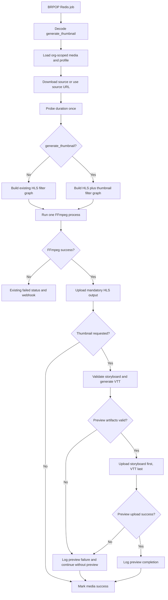

# Single-Storyboard WebVTT Thumbnail Generation for VOD Transcodes

**Status**: Done
**Complexity**: Medium
**Date**: 2026-08-26
**Created**: August 26, 2026
**Last Updated**: 2026-08-26
**Author**: Codex
**PRD ID**: PRD-2026-08-26-vtt-sprite-thumbnails

---

## 1. Summary

Extend Oxygen's standalone `golang-queue` VOD worker so a transcode job with `generate_thumbnail: true` produces exactly one first-frame poster JPEG, one bounded storyboard JPEG, and one WebVTT cue file alongside the video's existing HLS output.

Laravel already resolves the selected organization-scoped coding profile and includes its `generate_thumbnail` value in the Redis transcode job. The Go worker must decode that flag, add optional poster and storyboard branches to its existing single FFmpeg invocation, generate `thumbnails/storyboard.vtt` in Go, and upload root-level `thumbnail.jpg` plus `storyboard.jpg` and `storyboard.vtt` to the existing streaming S3 bucket.

The worker must not create one image per sampled frame and must not roll over into multiple sprite files. A configurable storyboard capacity bounds the number of sampled cells. Cell width is configurable, while cell height is derived per job from the source display aspect ratio, including sample aspect ratio and rotation. When a video is too long for the requested interval, the worker increases the effective sampling interval so every preview still fits into the single storyboard.

This PRD is deliberately limited to the `golang-queue` worker. It does not add Laravel API fields, database thumbnail state, player UI, Video.js behavior, live-stream thumbnails, or regeneration endpoints.

---

## 2. Problem

Oxygen's VOD worker currently produces adaptive HLS playlists and MPEG-TS segments only. Players therefore have no compact timeline-preview asset to display while a viewer hovers or scrubs through a video.

The selected coding profile now carries a `generate_thumbnail` boolean, and Laravel places that value in the Redis job payload. However, `golang-queue/internal/queue.Job` does not decode the field and the worker does not generate thumbnail artifacts. Jobs with the option enabled currently behave exactly like jobs with it disabled.

Generating individual image files for every hover time would be wasteful. The worker instead needs to sample a bounded number of frames, tile them into one storyboard JPEG, and publish a WebVTT file that maps time ranges to `#xywh` regions within that one image.

---

## 3. Goals

| # | Goal | Success Metric |
|---|------|----------------|
| G1 | Honor the queue flag | `generate_thumbnail: true` enables thumbnail generation and `false` preserves the existing pipeline |
| G2 | Preserve the worker's single-process transcode design | HLS renditions and the thumbnail branch are produced by one FFmpeg invocation per job |
| G3 | Produce deterministic preview metadata | `storyboard.vtt` has valid cues, a relative storyboard reference, correct coordinates, and a final cue clamped to duration |
| G4 | Bound output for long VOD assets | Every job creates at most one storyboard with no more than the configured maximum number of cells |
| G5 | Produce a player poster | Every enabled job creates one first-frame `thumbnail.jpg` at a predictable root-level media path |
| G6 | Reuse existing storage and cleanup | Assets use the streaming S3 client and the per-job temporary directory; local files are removed by existing cleanup |
| G7 | Keep thumbnails optional | Jobs without the field, or with the field set to `false`, produce byte-for-byte-equivalent HLS command behavior aside from unrelated existing nondeterminism |
| G8 | Avoid new runtime dependencies | Use FFmpeg plus Go standard-library code; do not add ImageMagick or an image-processing library |

---

## 4. Non-Goals

- Laravel profile UI or queue-dispatch changes; the producer already sends `generate_thumbnail`.
- Persisting `thumbnail_vtt_path`, thumbnail status, dimensions, or storyboard metadata in Postgres.
- Adding fields to `media_files` or `media_file_profiles`.
- Exposing a public VTT URL through an API response.
- Integrating timeline previews into the React player or Video.js.
- Live-stream or DVR thumbnail generation in `golang-live`.
- Retrofitting thumbnails onto previously completed videos.
- A user-facing retry or regenerate-thumbnails action.
- Scene-aware sampling, animated previews, WebP/AVIF storyboards, or HLS I-frame playlists.
- Multiple storyboard/sprite image files per video.
- Running a second FFmpeg process solely for thumbnail generation.
- Changing the existing `VideoQuality` mappings.

---

## 5. Users and Stakeholders

| User / System | Need |
|---------------|------|
| Organization admin | A profile-level option that results in preview artifacts for newly transcoded VOD content |
| Playback application | A predictable WebVTT and sprite location it can consume in a later integration |
| Platform operator | Thumbnail generation that is observable, bounded, and does not create a separate worker system |
| `golang-queue` maintainer | Testable Go components that fit the current config, FFmpeg, S3, and queue packages |

---

## 6. Current Codebase Baseline

| Area | Current State | Required Change |
|------|---------------|-----------------|
| Redis job | Laravel LPUSH payload includes `generate_thumbnail` as a JSON boolean | Decode it in the Go `Job` struct |
| Queue consumer | `internal/queue/consumer.go` validates the job, loads media/profile data, creates `jobDir/hls`, runs the transcoder, uploads HLS, and marks success | Create an optional thumbnail directory, pass thumbnail options to the transcoder, generate VTT, and publish optional assets |
| Transcoder | `internal/transcode/transcoder.go` builds one `-filter_complex` with `split=N`, maps all renditions, and launches one FFmpeg process | When enabled, use `split=N+1` and add a sampling/scale/pad/tile branch plus image output |
| Probing | FFprobe supplies duration and stream metadata; `probeHasAudio` checks audio separately | Probe duration, dimensions, sample aspect ratio, and rotation together; reuse the result for progress, cell sizing, and VTT |
| Configuration | `internal/config.Config` contains worker, FFmpeg, HLS, and progress settings | Add validated thumbnail layout settings |
| Local files | Consumer creates a UUID-based per-job directory and defers `os.RemoveAll(jobDir)` | Place all thumbnail output under that same job directory |
| S3 | `internal/s3.Client.UploadHLS` uploads the HLS tree to `hls/{org}/{media}/` | Add an optional thumbnail upload path under the same media prefix with correct MIME types and VTT-last ordering |
| Tests | One queue context test; no transcode/config/VTT tests | Add table-driven unit tests and a small FFmpeg integration test when FFmpeg is available |

---

## 7. Job Contract

The Go job struct must add the correctly spelled field:

```go
GenerateThumbnail bool `json:"generate_thumbnail"`
```

Example payload:

```json
{
  "id": "media-file-uuid",
  "organization_id": "organization-uuid",
  "file_path": "media/organization-uuid/source.mp4",
  "status": "uploaded",
  "progress": 0,
  "generate_thumbnail": true
}
```

Requirements:

- Missing `generate_thumbnail` must decode to Go's zero value, `false`.
- The worker must never accept a thumbnail output path from the job payload.
- The existing `id` and `organization_id` validation remains unchanged.
- The flag controls preview generation only; it must not change selected HLS qualities.
- Structured job-received logging should include `generate_thumbnail`.

---

## 8. Default Configuration

Add one thumbnail configuration section to `internal/config.Config`, populated from environment variables.

| Variable | Default | Validation | Purpose |
|----------|---------|------------|---------|
| `THUMBNAIL_INTERVAL_SECONDS` | `10` | 1–3600 | Preferred sampling interval before applying the storyboard capacity cap |
| `THUMBNAIL_WIDTH` | `160` | 32–1920 | Cell width in pixels |
| `THUMBNAIL_COLUMNS` | `10` | 1–20 | Maximum columns in the storyboard |
| `THUMBNAIL_ROWS` | `10` | 1–20 | Maximum rows in the storyboard |
| `THUMBNAIL_JPEG_QUALITY` | `5` | 2–31 | FFmpeg JPEG `-q:v` value; lower is higher quality |
| `THUMBNAIL_POSTER_WIDTH` | `960` | 32–8192 | Width of the first-frame `thumbnail.jpg`; height is aspect-derived |

Additional constraints:

- `columns * rows` is the hard maximum number of thumbnail cells; the default maximum is 100.
- `width * columns` must not exceed 8192 pixels.
- The derived cell height multiplied by rows must not exceed 8192 pixels.
- The derived poster height must not exceed 8192 pixels.
- Invalid thumbnail configuration must fail worker startup with a descriptive error rather than silently falling back.
- JPEG is the only output format in this version, so no format setting is required.
- Per-job enablement comes only from `generate_thumbnail`; do not add a second global enabled flag.

Default layout:

```text
cell width:          160
cell height:         derived from source display aspect ratio
maximum grid:        10 x 10
maximum cells:       100
maximum width:       1600
maximum height:      8192
preferred interval:  10 seconds
output images:       exactly 1 storyboard JPEG
```

### Bounded adaptive sampling

Let:

```text
preferredInterval = configured interval
capacity          = columns * rows
preferredCount    = ceil(duration / preferredInterval)
storyboardCellCount = min(preferredCount, capacity)
```

If `preferredCount <= capacity`, use the preferred interval. If the video would require more cells than the storyboard can hold, increase the interval:

```text
effectiveInterval = duration / capacity
storyboardCellCount = capacity
```

Examples with the default 100-cell capacity:

```text
25-second video
preferred interval = 10 seconds
storyboard cell count = 3
effective interval = 10 seconds

1-hour video
preferred count = 360
storyboard cell count = 100
effective interval = 36 seconds

10-hour video
preferred count = 3600
storyboard cell count = 100
effective interval = 360 seconds
```

This guarantees a single bounded storyboard instead of generating hundreds of image files or multiple sprite sheets.

---

## 9. Target Asset Layout

Keep the existing HLS keys unchanged and add a sibling thumbnail directory below the same media prefix:

```text
hls/{organization_id}/{media_file_id}/
├── main.m3u8
├── thumbnail.jpg
├── v0/
│   ├── playlist.m3u8
│   └── segment_0.ts
├── v1/
│   └── ...
└── thumbnails/
    ├── storyboard.jpg
    └── storyboard.vtt
```

The corresponding deterministic public URL is:

```text
{STREAMING_AWS_URL}/{HLS_PREFIX}/{organization_id}/{media_file_id}/thumbnails/storyboard.vtt
```

The worker does not persist or expose these URLs in the initial implementation. The deterministic poster URL is:

```text
{STREAMING_AWS_URL}/{HLS_PREFIX}/{organization_id}/{media_file_id}/thumbnail.jpg
```

Every VTT cue must reference the same storyboard by relative filename. This example assumes a 16:9 source, whose derived cell height is 90 pixels at width 160:

```vtt
storyboard.jpg#xywh=0,0,160,90
```

---

## 10. Worker Flow



### Required sequencing

1. Decode and validate the queue job.
2. Load the organization-scoped media record and its profile qualities as today.
3. Resolve the local source path as today.
4. Probe duration once before building VTT metadata.
5. Create `jobDir/hls` and, only when requested, `jobDir/thumbnails`.
6. Run one FFmpeg invocation.
7. Treat an FFmpeg process failure as the existing transcode failure.
8. Upload HLS as the mandatory primary output.
9. Validate the single storyboard and generate WebVTT.
10. Upload `storyboard.jpg` first and `storyboard.vtt` last.
11. A post-FFmpeg preview validation or preview upload failure must be logged but must not change an otherwise successful HLS result to failed.
12. Mark the media successful and emit the existing success webhook.
13. Let the existing deferred `os.RemoveAll(jobDir)` remove all local output.

---

## 11. FFmpeg Design

### Single invocation requirement

`golang-queue` has a non-negotiable one-FFmpeg-invocation-per-job rule. Thumbnail generation must therefore extend the existing filter graph instead of launching a second FFmpeg command.

When thumbnails are disabled, retain the current graph:

```text
[0:v]split=N[v0][v1]...[vN-1]
```

When thumbnails are enabled:

```text
[0:v]split=N+2[v0][v1]...[vN-1][vthumb][vposter]
```

Each HLS rendition keeps its existing scale branch. The new thumbnail branch is conceptually:

```text
[vthumb]
fps=1/{effectiveInterval},
scale={width}:{derivedHeight},
setsar=1,
tile={layoutColumns}x{layoutRows}:nb_frames={storyboardCellCount}
[thumbout]
```

The poster branch selects only the first decoded video frame:

```text
[vposter]
select=eq(n\,0),
scale={posterWidth}:{derivedPosterHeight},
setsar=1
[posterout]
```

Calculate the bounded `storyboardCellCount`, `effectiveInterval`, and actual grid dimensions before building the filter. The cell count describes frames tiled inside the JPEG, not separate image files. Map `[thumbout]` to one fixed output path:

```text
jobDir/thumbnails/storyboard.jpg
```

Both image outputs must be limited to one image frame. Do not use incrementing image filename patterns. The tile filter must use only the calculated number of cells and must never overflow into another image. The poster output path is fixed to `jobDir/thumbnail.jpg`.

Use argument-array execution through `exec.CommandContext`; never build a shell command string.

### FFmpeg requirements

- Keep the configured cell width and derive an even cell height from the source display aspect ratio without letterboxing or distortion.
- Account for sample aspect ratio and 90/270-degree rotation metadata when calculating display aspect ratio.
- Generate approximately one cell per preferred interval until reaching capacity, then use the calculated adaptive interval.
- Generate no more than `columns * rows` cells.
- Produce exactly one `storyboard.jpg` when enabled and successful.
- Produce exactly one first-frame `thumbnail.jpg` at the configured poster width with an aspect-derived even height.
- Use the appropriate variable-frame-rate image output options and cap the mapped storyboard output at one frame.
- Use the configured JPEG `-q:v` value.
- Keep all existing HLS codec, bitrate, GOP, segment, playlist, progress, audio/no-audio, and multi-rendition behavior.
- Create required output directories before starting FFmpeg.
- Preserve the 200-line stderr ring buffer behavior.
- Preserve context cancellation and progress reporting.
- Avoid adding user-controlled strings to filter expressions or output paths.

### Duration reuse

Refactor the current flow so `ProbeDuration` is called once per job and its result is reused for:

- FFmpeg progress percentage.
- Expected storyboard cell count.
- VTT cue end time.
- Thumbnail completion logs.

Do not probe duration separately in the consumer and again after FFmpeg starts.

---

## 12. VTT Generator

Implement a deterministic component in `internal/thumbnail`, separate from FFmpeg command construction and S3 upload.

Suggested types:

```go
type Config struct {
    IntervalSeconds float64
    Width           int
    Height          int
    Columns         int
    Rows            int
}

type Plan struct {
    StoryboardCellCount int
    Columns             int
    Rows                int
    EffectiveInterval   float64
}

func BuildPlan(duration float64, cfg Config) (Plan, error)
func GenerateVTT(duration float64, cfg Config, plan Plan) (string, error)
```

Build the plan once after probing and before constructing the FFmpeg arguments. Reuse that same plan to generate the VTT after FFmpeg succeeds. The exact API may change to match local Go conventions, but planning and VTT generation must remain pure, independently testable operations.

### Cue calculation

For duration `D`, preferred interval `I`, and maximum capacity `C = configuredColumns * configuredRows`:

```text
preferredCount = ceil(D / I)
storyboardCellCount = min(preferredCount, C)

if preferredCount <= C:
    effectiveInterval = I
else:
    effectiveInterval = D / C

layoutColumns = min(configuredColumns, storyboardCellCount)
layoutRows    = ceil(storyboardCellCount / layoutColumns)
```

For zero-based thumbnail index `i`:

```text
start  = i * effectiveInterval
end    = min((i + 1) * effectiveInterval, duration)
column = i % layoutColumns
row    = floor(i / layoutColumns)
x           = column * width
y           = row * height
```

Cue target:

```text
storyboard.jpg#xywh={x},{y},{width},{height}
```

Every cue references `storyboard.jpg`. There is no sprite index, rollover, or secondary image.

### Timestamp format

Use locale-independent WebVTT timestamps:

```text
HH:MM:SS.mmm
```

Examples:

```text
0       -> 00:00:00.000
65.5    -> 00:01:05.500
3725    -> 01:02:05.000
90061.2 -> 25:01:01.200
```

Do not wrap hours at 24.

Round timestamps to the nearest millisecond consistently. The last cue must end at the probed duration rounded by the same formatter and must never intentionally extend to the next full interval.

### Example output

For a 16:9 source at the default width:

```vtt
WEBVTT

00:00:00.000 --> 00:00:10.000
storyboard.jpg#xywh=0,0,160,90

00:00:10.000 --> 00:00:20.000
storyboard.jpg#xywh=160,0,160,90

00:00:20.000 --> 00:00:25.000
storyboard.jpg#xywh=320,0,160,90
```

---

## 13. Artifact Validation

Before uploading preview assets, validate:

- Probed duration is greater than zero.
- `storyboard.vtt` content is non-empty and starts with `WEBVTT`.
- Expected storyboard cell count is at least one.
- Expected storyboard cell count does not exceed the configured storyboard capacity.
- `storyboard.jpg` exists, is non-empty, and is a regular file within `jobDir/thumbnails`.
- No second JPEG or incrementing storyboard file exists.
- Every VTT cue references `storyboard.jpg`.
- No unexpected path traversal or symlink is followed during upload.
- The final cue end does not exceed the formatted video duration.

If validation fails after HLS was generated successfully:

- Remove or ignore the incomplete thumbnail directory.
- Log the failure with the media file ID and validation reason.
- Continue uploading/marking the HLS transcode successful without a VTT.

---

## 14. S3 Upload Requirements

Extend the existing streaming S3 abstraction rather than creating another client.

Suggested interface addition:

```go
UploadThumbnails(ctx context.Context, localDir, orgID, mediaFileID string) error
UploadPoster(ctx context.Context, localPath, orgID, mediaFileID string) error
```

Upload destination:

```text
{HLS_PREFIX}/{orgID}/{mediaFileID}/thumbnails/{filename}
{HLS_PREFIX}/{orgID}/{mediaFileID}/thumbnail.jpg
```

Content types:

| Extension | Content-Type |
|-----------|--------------|
| `.jpg` | `image/jpeg` |
| `.vtt` | `text/vtt; charset=utf-8` |

Publishing rules:

1. Upload `storyboard.jpg` first.
2. Upload `storyboard.vtt` only after the image succeeds.
3. Do not publish the VTT if the storyboard upload fails.
4. Preview upload failure is best effort and must not undo a successful mandatory HLS upload.
5. Do not log credentials, signed URLs, or source URLs containing secrets.
6. Poster upload is independent from storyboard/VTT upload so one optional artifact cannot suppress the other.

No new bucket or AWS credentials are introduced.

---

## 15. Failure Policy

HLS is the primary output; thumbnails are optional.

| Failure | Required Outcome |
|---------|------------------|
| Queue JSON is malformed or required IDs are missing | Existing behavior: discard/log invalid job |
| HLS/combined FFmpeg invocation fails | Existing behavior: media status `failed`, failed webhook |
| Duration is invalid for a thumbnail-enabled job | Run HLS without publishing preview if the command can safely proceed; log thumbnail unavailability |
| FFmpeg succeeds but no valid storyboard exists | Upload HLS, skip VTT, mark media success, log thumbnail failure |
| VTT generation or validation fails | Upload HLS, skip preview, mark media success |
| HLS upload fails | Existing behavior: media status `failed` |
| Storyboard or VTT upload fails | HLS remains successful; do not publish VTT unless the storyboard uploaded |
| Poster validation or upload fails | HLS and valid storyboard assets remain successful; log the poster failure |
| `generate_thumbnail` is absent or false | Existing HLS-only behavior |

Because thumbnails share the required single FFmpeg process, an FFmpeg process-level failure cannot be isolated from HLS. Post-process validation and storage failures must be isolated.

No new database thumbnail status is added in this phase. Observability is provided through structured logs.

---

## 16. Observability

Add structured logs without introducing a metrics dependency.

### Required events

```text
thumbnail_generation_enabled
thumbnail_generation_completed
thumbnail_generation_failed
thumbnail_upload_completed
thumbnail_upload_failed
```

### Required safe fields where available

```text
media_file_id
organization_id
duration_seconds
interval_seconds
storyboard_cell_count
effective_interval_seconds
storyboard_width
storyboard_height
output_bytes
elapsed_ms
error
```

The existing job and transcode logs should also show whether thumbnail generation was requested. Do not log Redis credentials, AWS credentials, signed URLs, or full FFmpeg source URLs.

---

## 17. Testing Requirements

### Queue contract tests — `internal/queue`

- JSON with `generate_thumbnail: true` decodes to `Job.GenerateThumbnail == true`.
- JSON with `generate_thumbnail: false` decodes to false.
- Legacy JSON without the field decodes to false.
- Existing required `id` and `organization_id` behavior remains unchanged.

### Config tests — `internal/config`

- Defaults load exactly as documented.
- Each numeric field rejects non-numeric values.
- Lower and upper bounds are enforced.
- Excessive configured width or derived storyboard height is rejected.

### VTT unit tests — `internal/thumbnail`

| Case | Input | Expected |
|------|-------|----------|
| Basic | duration 30, interval 10 | Three cues: 0–10, 10–20, 20–30 |
| Partial last cue | duration 25, interval 10 | Final cue is 20–25 |
| Short video | duration 5, interval 10 | One cue from 0–5 |
| Fractional duration | duration 64.325 | Final timestamp preserves milliseconds |
| Coordinate | index 23, 10 columns, 160×90 cell from a 16:9 source | `xywh=480,180,160,90` |
| Source aspect ratio | width 160 with 4:3, 1:1, and 9:16 sources | Derived even heights are 120, 160, and approximately 284 pixels |
| Capacity boundary | duration requiring exactly 100 cells | Exactly 100 cues reference one storyboard; index 99 uses the final cell |
| Over capacity | one-hour video at preferred 10-second interval | Exactly 100 cues with an effective interval of 36 seconds |
| One hour+ timestamp | 3725 seconds | Timestamp `01:02:05.000` |
| More than 24 hours | 90061.2 seconds | At most 100 cues; timestamp `25:01:01.200` does not wrap |
| Invalid duration | 0, negative, NaN, infinity | Descriptive error and no output |
| Invalid layout | zero interval/dimensions/grid | Descriptive error |

### FFmpeg argument-builder tests — `internal/transcode`

- Disabled mode produces no thumbnail label, filter, map, or image output.
- Enabled mode increases the initial video split by exactly one.
- Enabled mode includes `fps`, derived-dimension `scale`, square-pixel `setsar`, and `tile` filters.
- Storyboard output uses the job-specific thumbnail directory and fixed `storyboard.jpg` filename.
- Poster output uses the fixed root-level `thumbnail.jpg` filename, selects only frame zero, and is limited to one image.
- All existing HLS mappings remain present for audio and no-audio inputs.
- Unknown qualities and empty rendition lists still fail as today.

Prefer extracting deterministic argument/filter construction into testable helpers rather than testing private subprocess state indirectly.

### S3 tests — `internal/s3`

- The single storyboard object uses `image/jpeg`.
- VTT uses `text/vtt; charset=utf-8`.
- `storyboard.jpg` is uploaded before `storyboard.vtt`.
- VTT is not attempted after storyboard upload failure.
- Keys remain under the expected media thumbnail prefix.
- Poster uses `image/jpeg` at `{media prefix}/thumbnail.jpg`.

### FFmpeg integration test

When `ffmpeg` and `ffprobe` are available:

1. Generate a tiny synthetic source with FFmpeg test patterns at test runtime.
2. Run a short transcode with thumbnails enabled.
3. Assert HLS playlists and at least one segment exist.
4. Assert exactly one non-empty `storyboard.jpg` exists.
5. Assert exactly one non-empty first-frame `thumbnail.jpg` exists at the media root.
6. Assert VTT exists, contains the expected cue count, and every cue references `storyboard.jpg`.
7. Assert storyboard and poster dimensions match their aspect-derived calculations.

The test must skip with an explicit reason when FFmpeg is unavailable. Do not commit a large binary fixture.

### Regression command

```bash
cd golang-queue
go test ./...
```

---

## 18. Acceptance Criteria

- [x] `Job` decodes the JSON key `generate_thumbnail` into a boolean field.
- [x] Missing queue fields remain backward-compatible and disable thumbnails.
- [x] A job with `generate_thumbnail: false` follows the existing HLS-only path.
- [x] A job with `generate_thumbnail: true` produces HLS and exactly one storyboard JPEG in one FFmpeg invocation.
- [x] Default preferred sampling interval is 10 seconds.
- [x] Default cell width is 160 pixels; cell height is derived per source.
- [x] Source display aspect ratio is preserved without padding or distortion.
- [x] Sample aspect ratio and rotation metadata affect the derived cell height.
- [x] Default maximum storyboard grid is 10 × 10 with a hard capacity of 100 cells.
- [x] Videos requiring more than 100 preferred samples use an increased effective interval.
- [x] No video produces more than 100 cells with the default configuration.
- [x] No video produces more than one storyboard image.
- [x] Every enabled job produces exactly one first-frame poster named `thumbnail.jpg`.
- [x] Poster width defaults to 960 pixels and poster height follows the source display aspect ratio.
- [x] The image filename is always `storyboard.jpg`.
- [x] `storyboard.vtt` starts with `WEBVTT` and a blank line.
- [x] VTT cues use correct time ranges and `#xywh` coordinates.
- [x] The final cue is clamped to the actual duration.
- [x] Timestamps support fractional seconds, videos longer than one hour, and hours greater than 24.
- [x] Every VTT cue references the relative filename `storyboard.jpg`.
- [x] Preview assets upload below the existing media HLS prefix.
- [x] Poster uploads to `{media HLS prefix}/thumbnail.jpg` for direct use as a video `poster` URL.
- [x] `storyboard.jpg` uploads before `storyboard.vtt`.
- [x] JPEG and VTT objects receive correct content types.
- [x] Invalid or missing thumbnail artifacts do not publish a VTT.
- [x] Post-FFmpeg preview validation/upload failure does not fail an otherwise successful HLS transcode.
- [x] Existing media status, progress, streaming URL, and webhook behavior remains unchanged.
- [x] Existing per-job temporary cleanup removes thumbnail files on success and failure.
- [x] No ImageMagick or new image-processing dependency is added.
- [x] No new database schema is required for this worker-only phase.
- [x] `go test ./...` passes.

---

## 19. Implementation Plan

### Phase 1 — Contract and configuration

1. Add `GenerateThumbnail` to `queue.Job`.
2. Add queue JSON compatibility tests.
3. Add thumbnail fields and validation to `config.Config`.
4. Document the new environment variables in `golang-queue/.env.example` and `golang-queue/README.md` during implementation.

### Phase 2 — Pure VTT generation

1. Create `internal/thumbnail` configuration/metadata types.
2. Implement timestamp formatting, bounded adaptive sampling, storyboard cell calculation, and VTT generation.
3. Add comprehensive table-driven unit tests.

### Phase 3 — FFmpeg integration

1. Refactor duration probing so the result is reused.
2. Extract deterministic filter/argument construction where necessary.
3. Add the optional thumbnail split/filter/map/output to the existing single command.
4. Preserve disabled command behavior.
5. Add argument-builder and FFmpeg integration tests.

### Phase 4 — Consumer orchestration

1. Create the thumbnail temp directory only when requested.
2. Pass the option/config/duration into the transcoder.
3. Validate the single storyboard and write the VTT after successful FFmpeg completion.
4. Keep preview failures isolated after HLS generation.
5. Add structured logs.

### Phase 5 — Storage

1. Extend the existing S3 abstraction with optional preview upload.
2. Add JPEG/VTT MIME types.
3. Enforce storyboard-first, VTT-last publishing.
4. Add storage ordering and failure tests.

### Phase 6 — Verification

1. Run `go test ./...`.
2. Run a real local transcode with `generate_thumbnail` both false and true.
3. Inspect storyboard dimensions, bounded cell count, and VTT cues.
4. Confirm the HLS-only output is unchanged when disabled.
5. Confirm local temp cleanup and S3 object layout.

---

## 20. Dependencies

- Laravel queue producer must continue sending the correctly spelled `generate_thumbnail` boolean.
- Worker runtime image must include FFmpeg filters `fps`, `scale`, `pad`, and `tile`, plus JPEG encoding support.
- Existing source and streaming S3 configuration must be valid.
- Streaming bucket/CDN must serve `.vtt` and `.jpg` objects; CORS/player integration is a later application concern.
- Docker/supervisor changes are not expected because this extends the existing `go-queue` process.

---

## 21. Assumptions

- Thumbnail generation is required only for newly queued VOD jobs.
- JPEG support is available in the deployed FFmpeg build.
- `generate_thumbnail` is trusted because Laravel derives it from an organization-scoped profile rather than accepting it from upload completion input.
- A deterministic VTT location is sufficient for this worker phase; no database metadata is required yet.
- The existing streaming prefix remains stable.
- The current worker rule of one FFmpeg invocation per job takes precedence over the pasted generic design's recommendation to use a separate thumbnail process.

---

## 22. Open Questions

1. Should the follow-up Laravel/API phase expose a derived `thumbnail_vtt_url`, or persist an explicit nullable URL/status on `media_files`?
2. Should thumbnail assets use immutable versioned paths when regeneration is introduced, or may a future regeneration overwrite the current deterministic keys?
3. Should a combined FFmpeg process failure caused specifically by the thumbnail output be retried once with thumbnails disabled, or remain a normal job failure in the first release?
4. Should the streaming bucket attach long-lived cache headers now, or should caching be addressed with the future player/CDN integration?

---

## 23. Follow-Up PRDs

The following work should remain separate:

- Laravel/API exposure of a public VTT URL and optional persisted preview state.
- React/Video.js timeline hover and touch-scrub preview UI.
- Independent thumbnail regeneration and versioned asset paths.
- Backfill of thumbnails for existing completed media.
- Live-stream/DVR preview thumbnails in `golang-live`.

---

### Execution Notes

- **Completed:** 2026-08-26
- **Implementation:** Added the queue flag contract, validated thumbnail configuration, bounded storyboard planning, WebVTT generation, a single optional FFmpeg storyboard output, artifact validation, ordered S3 publishing, safe structured logging, and worker documentation.
- **Verification:** `go test -count=1 ./...` passed, including the real FFmpeg integration test; `go vet ./...` passed; `go build ./cmd/worker` passed; `git diff --check` passed.
- **Aspect-ratio correction:** On 2026-08-26, fixed cell height was removed. The worker now derives an even height from each source video's display aspect ratio, including sample aspect ratio and rotation metadata; the real FFmpeg integration fixture uses 4:3 video and verifies 160×120 cells.
- **Poster addition:** On 2026-08-26, the enabled pipeline was extended to select frame zero into one root-level `thumbnail.jpg` in the same FFmpeg invocation. Default poster width is 960, height is aspect-derived, and poster storage failure remains isolated from HLS and storyboard publication.

## 24. Definition of Done

This worker phase is done when a VOD job queued with `generate_thumbnail: true` completes through the existing `golang-queue` process and publishes:

```text
hls/{organization_id}/{media_file_id}/main.m3u8
hls/{organization_id}/{media_file_id}/v*/playlist.m3u8
hls/{organization_id}/{media_file_id}/v*/segment_*.ts
hls/{organization_id}/{media_file_id}/thumbnail.jpg
hls/{organization_id}/{media_file_id}/thumbnails/storyboard.jpg
hls/{organization_id}/{media_file_id}/thumbnails/storyboard.vtt
```

and `thumbnail.jpg` contains the first video frame at the configured poster width, while the VTT maps each effective time interval to the correct cell within the one storyboard. A job with the flag absent or false remains an HLS-only transcode. With default configuration, no video may generate more than one poster JPEG, one storyboard JPEG, or more than 100 storyboard cells.
