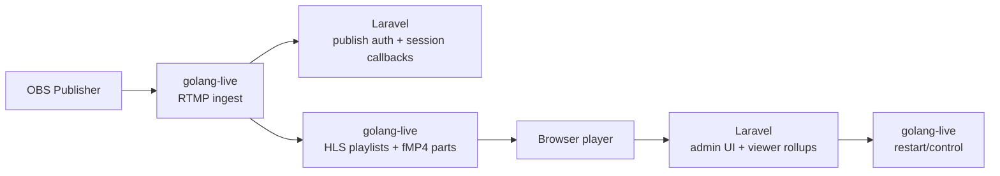
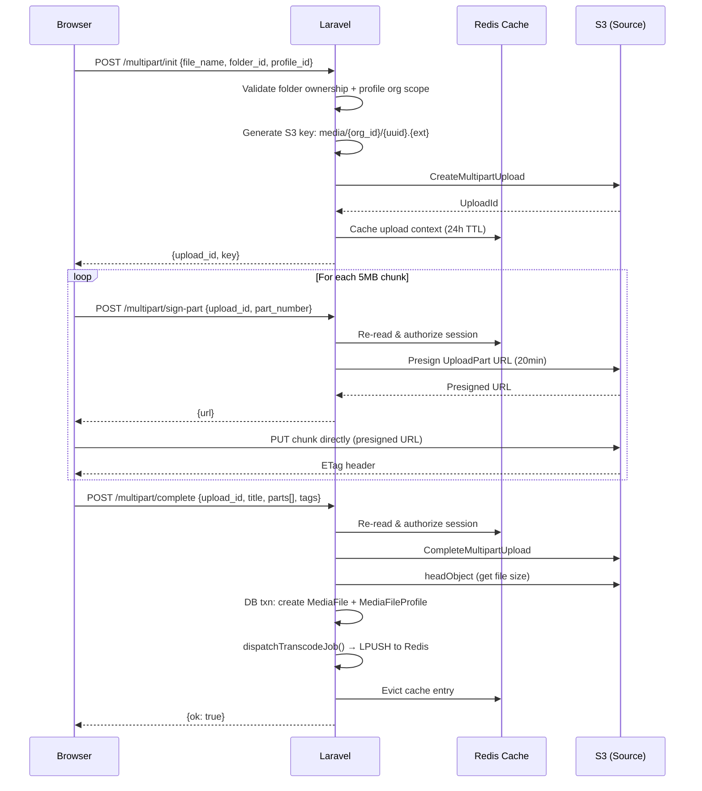
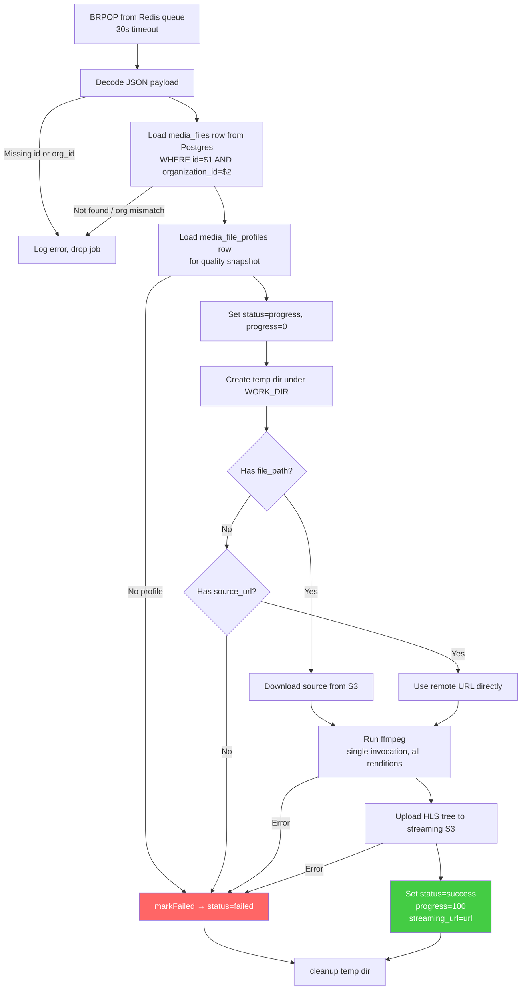
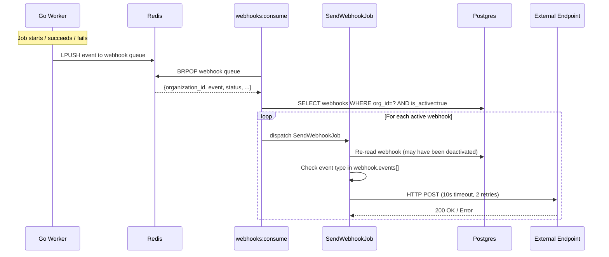
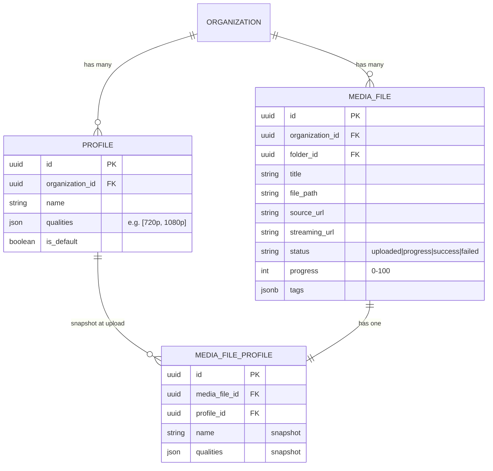
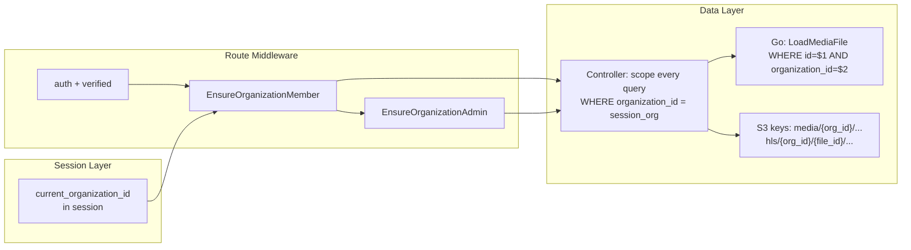

# Oxygen — Video Transcoding Platform

A multi-tenant video transcoding service built with **Laravel 13 + Inertia v3 + React 19** on the web layer, a standalone **Go worker** for FFmpeg-based transcoding, and a separate **Go live service** for live-stream runtime concerns. VOD transcoding coordinates through shared **Postgres**, **Redis**, and **S3**. Live streaming uses Laravel as the control plane and the Go live service for publish auth proxying, session callbacks, HLS serving, and viewer rollups.

## Architecture Overview

Oxygen has two runtime paths: VOD transcoding and live streaming. Laravel is the control plane for both.

VOD path:

```
┌──────────────┐      ┌──────────────┐      ┌──────────────┐
│   Browser    │      │   Laravel    │      │  Go Worker   │
│  (React/     │─────▶│  (Upload &   │─────▶│  (FFmpeg     │
│   Inertia)   │      │   Manage)    │      │   Transcode) │
└──────┬───────┘      └──────┬───────┘      └──────┬───────┘
       │                     │                     │
       │  S3 Direct Upload   │    Redis (Jobs)     │
       └─────────────────────┤◄────────────────────┤
                             │                     │
                     ┌───────▼───────┐     ┌───────▼───────┐
                     │    Amazon     │     │    Postgres   │
                     │      S3       │     │  (media_files │
                     │ (Source +     │     │   profiles)  │
                     │  Streaming)   │     └───────────────┘
                     └───────────────┘
```

Live path:

```
┌──────────────┐      ┌──────────────┐      ┌──────────────┐
│     OBS      │─────▶│  golang-live │─────▶│ Browser      │
│  Publisher   │      │ (RTMP + HLS) │      │ Player       │
└──────┬───────┘      └──────┬───────┘      └──────┬───────┘
       │                     │                     │
       │  RTMP Publish       │    HLS Playback     │
       └─────────────────────┤◄────────────────────┘
                             │
                     ┌───────▼───────┐
                     │    Laravel    │
                     │ (Auth + live  │
                     │  callbacks +  │
                     │  viewer rollup)│
                     └───────────────┘
```



Live streaming uses Laravel for stream records, encrypted keys, admin UI, and viewer metrics. The standalone Go live service handles RTMP ingest, validates publishers against Laravel, remuxes the stream into HLS, serves playback, and reports session and viewer state back to Laravel.

## Running Locally — Step by Step

Oxygen is **not a single process**. A full local stack runs the Laravel web app plus several long-running workers and two standalone Go services. This section walks through every piece.

### What runs, and why

| # | Process | Command | Needed for |
|---|---------|---------|-----------|
| 1 | Laravel web (HTTP) | `php artisan serve` (or Octane) | The app UI + API |
| 2 | Vite dev server | `npm run dev` | Frontend hot reload (dev only) |
| 3 | Laravel queue worker | `php artisan queue:listen` | Webhook delivery jobs, mail, etc. |
| 4 | Webhook consumer | `php artisan webhooks:consume` | Turns Go/Laravel webhook events into delivery jobs |
| 5 | Go transcode worker | `go run ./cmd/worker` (in `golang-queue/`) | VOD transcoding (ffmpeg → HLS) |
| 6 | Go live service | `go run ./cmd/live` (in `golang-live/`) | Live streaming (RTMP ingest + HLS) |
| 7 | Laravel scheduler | `php artisan schedule:work` | Periodic tasks — daily prune of old viewer rollups (`rollups:prune`) |

`composer run dev` bundles **1–3 + logs** into one command. **4, 5, 6, and 7 are always separate.** Skip 6 if you are not using live streaming. Skip 7 in short dev sessions — it only matters for long-running/production environments.

### Prerequisites

Install these first:

- **PHP 8.4** + **Composer**
- **Node 20+** + **npm**
- **Go 1.25+**
- **FFmpeg** (`ffmpeg` + `ffprobe` on `PATH`) — required by the transcode worker
- **PostgreSQL** — shared by Laravel and both Go services
- **Redis** — job + webhook queues
- **S3** — an AWS bucket, or MinIO locally (separate source + streaming buckets recommended)

### Step 1 — Configure and set up the Laravel app

```bash
# from the repo root (oxygen/)
composer run setup     # installs deps, copies .env, generates key, migrates, builds frontend
```

Then edit `.env` and set at least:

```dotenv
# Database (shared with the Go services)
DB_CONNECTION=pgsql
DB_HOST=127.0.0.1
DB_PORT=5432
DB_DATABASE=oxygen
DB_USERNAME=postgres
DB_PASSWORD=secret

# Redis
REDIS_HOST=127.0.0.1
REDIS_PORT=6379

# S3 (source uploads + streaming output)
AWS_ACCESS_KEY_ID=...
AWS_SECRET_ACCESS_KEY=...
AWS_DEFAULT_REGION=us-east-1
AWS_BUCKET=oxygen-source

# Live streaming (must match the golang-live env — see Live Streaming section)
LIVE_RTMP_URL=rtmp://127.0.0.1:1935/live
LIVE_HLS_URL=http://127.0.0.1:8081/live
LIVE_SERVICE_TOKEN=change-me-live-service-token
LIVE_CONTROL_URL=http://127.0.0.1:8081
LIVE_CONTROL_TOKEN=change-me-live-control-token
```

Re-run migrations if you set up the DB after `setup`: `php artisan migrate`.

### Step 2 — Start the core Laravel stack

```bash
composer run dev
```

This runs the web server (`http://127.0.0.1:8000`), the queue worker, log tailing (`pail`), and Vite — all in one terminal.

> Running under **Laravel Octane / FrankenPHP** instead? Use `composer run dev:octane` (octane with `--watch` + queue + logs + vite), or run `php artisan octane:start --max-requests=500` standalone. Either way, still run the webhook consumer and Go services separately. See the Octane notes in `CLAUDE.md`.

### Step 3 — Start the webhook consumer (new terminal)

```bash
php artisan webhooks:consume
```

This drains webhook events (pushed by the Go worker and Laravel) and dispatches `SendWebhookJob`s. Skip if you are not using webhooks.

### Step 4 — Start the Go transcode worker (new terminal)

```bash
cd golang-queue
cp .env.example .env     # first time only
# edit .env: REDIS_ADDR, QUEUE_KEY, DB_*, AWS_* / SOURCE_AWS_* / STREAMING_AWS_*, FFMPEG_BIN
go run ./cmd/worker
```

Key env values (see `golang-queue/.env.example` for the full list):

```dotenv
REDIS_ADDR=127.0.0.1:6379
QUEUE_KEY=oxygen-database-queues:transcode   # must match Laravel's queue key
DB_HOST=127.0.0.1
DB_DATABASE=oxygen
SOURCE_AWS_BUCKET=oxygen-source
STREAMING_AWS_BUCKET=oxygen-streaming
FFMPEG_BIN=ffmpeg
```

The worker BRPOPs from `QUEUE_KEY`, reads the profile from Postgres, runs ffmpeg, and uploads the HLS tree to the streaming bucket.

### Step 5 — Start the Go live service (new terminal, optional)

Only needed for live streaming. Tokens **must match** the Laravel `.env` from Step 1.

```bash
cd golang-live
LIVE_ADDR=:8081 \
LIVE_RTMP_ADDR=:1935 \
LIVE_HLS_ROOT=/tmp/oxygen-live/hls \
LARAVEL_URL=http://127.0.0.1:8000 \
LIVE_SERVICE_TOKEN=change-me-live-service-token \
LIVE_CONTROL_TOKEN=change-me-live-control-token \
go run ./cmd/live
```

See [Live Streaming](#live-streaming) for the OBS setup and full endpoint list.

### Step 6 — Start the Laravel scheduler (new terminal, optional in dev)

```bash
php artisan schedule:work
```

This runs scheduled tasks — currently the daily `rollups:prune`, which deletes per-minute live viewer rollups older than 30 days (session summaries are kept). In production, prefer a single cron entry instead:

```cron
* * * * * cd /path/to/oxygen && php artisan schedule:run >> /dev/null 2>&1
```

Run a one-off prune manually with `php artisan rollups:prune --days=30`.

### Step 7 — Verify

1. Open `http://127.0.0.1:8000` and register (creates an org and logs you in as admin).
2. Upload a video under **Manage** — it goes straight to S3, then a job lands on Redis.
3. Watch the **Go transcode worker** terminal pick it up; the file status moves `uploaded → progress → success`.
4. For live: create a live stream in the admin UI, point OBS at it, and watch playback.

---

## Upload Flow (S3 Direct Multipart)

The browser uploads directly to S3. The Laravel app never proxies file bytes — it only issues presigned URLs and records metadata.



**Security**: The server never trusts `uploadId`, `key`, or `folder_id` from the client. Every endpoint re-reads the upload context from cache and re-checks `organization_id` against the session.

## Transcoding Pipeline

The Go worker is a standalone binary. It shares Postgres, Redis, and S3 with Laravel but makes no HTTP calls to it.



### Single FFmpeg Invocation

All renditions are produced in **one ffmpeg call** using `filter_complex` with `split=N` to avoid re-decoding the source:

```
ffmpeg -i source.mp4 \
  -filter_complex "[0:v]split=2[v0][v1];[v0]scale=1280:720[vout0];[v1]scale=1920:1080[vout1]" \
  -map "[vout0]" -c:v:0 libx264 -b:v:0 2800k \
  -map "[vout1]" -c:v:1 libx264 -b:v:1 5000k \
  -map a:0 -c:a:0 aac -b:a:0 128k \
  -map a:0 -c:a:1 aac -b:a:1 128k \
  -f hls -hls_time 6 -hls_playlist_type vod \
  -var_stream_map "v:0,a:0 v:1,a:1" \
  -master_pl_name main.m3u8
  output/hls/v%v/segment_%d.ts
```

Progress is parsed from `out_time_us=` on stdout, capped at 99 during encoding, and written to Postgres with a 2-second throttle.

## Webhook Notification System



**Event types**: `file_uploaded` (from Laravel), `file_status_changed` with status `progress`/`success`/`failed` (from Go worker).

**Delivery guarantees**: 3 attempts with backoff `[5s, 30s, 120s]`. Webhooks are re-read from DB before each attempt — deactivating a webhook stops pending deliveries.

## Live Streaming

Live streams are managed from the Laravel admin UI and served by the standalone Go service in `golang-live/`.

Laravel owns:

- stream records, encrypted stream keys, statuses, restart flags, and viewer rollups
- admin-only stream management under `admin/organizations/{organization}/live-streams`
- internal callback endpoints under `internal/live/*`
- control requests to the Go live service, such as stream restart

The Go live service owns:

- RTMP ingest on `LIVE_RTMP_ADDR`
- publish auth proxying to Laravel
- session start/end/fail callbacks to Laravel
- HLS file serving from a local HLS root
- viewer cookies, active viewer tracking, and minute rollup snapshots

Live output is written as fMP4 HLS, not `.ts` files. Under `LIVE_HLS_ROOT`, each stream gets its own directory containing playlists like `index.m3u8` and media files like `*_init.mp4`, `*_segNN.mp4`, and `*_partNNN.mp4`.

### Laravel Live Configuration

Set these values in the Laravel `.env` file:

```dotenv
LIVE_RTMP_URL=rtmp://127.0.0.1:1935/live
LIVE_RTMP_ADDR=:1935
LIVE_HLS_URL=http://127.0.0.1:8081/live
LIVE_SERVICE_TOKEN=change-me-live-service-token
LIVE_CONTROL_URL=http://127.0.0.1:8081
LIVE_CONTROL_TOKEN=change-me-live-control-token
```

`LIVE_SERVICE_TOKEN` must match the Go service value so Go can call Laravel `internal/live/*` endpoints with `X-Live-Service-Token`.

`LIVE_CONTROL_TOKEN` must match the Go service value so Laravel can call Go control endpoints with `Authorization: Bearer ...`.

After changing env or routes, run:

```bash
php artisan optimize:clear
php artisan migrate
php artisan wayfinder:generate
```

### Live Stream Setup

1. Put the Laravel live settings above into `.env`.
2. Configure the Go live service with the same `LIVE_SERVICE_TOKEN` and `LIVE_CONTROL_TOKEN`.
3. Start Laravel and the Go live service:

```bash
composer run dev
cd golang-live
go run ./cmd/live
```

4. In the admin UI, open an organization and create a live stream.
5. Copy the stream values from the live stream page:
   - `Server`: `rtmp://127.0.0.1:1935/live`
   - `Stream key`: `{public_id}?key={stream_key}`
   - `M3U8 URL`: use the playback URL shown on the page
6. In OBS, set `Keyframe Interval` to `2` seconds.
7. Start streaming from OBS, then open the live stream page to watch the HLS playback.

### Run The Go Live Service

From `golang-live/`:

```bash
LIVE_ADDR=:8081 \
LIVE_RTMP_ADDR=:1935 \
LIVE_HLS_ROOT=/tmp/oxygen-live/hls \
LARAVEL_URL=http://127.0.0.1:8000 \
LIVE_SERVICE_TOKEN=change-me-live-service-token \
LIVE_CONTROL_TOKEN=change-me-live-control-token \
go run ./cmd/live
```

Build it with:

```bash
go build -o bin/live ./cmd/live
```

The service exposes:

| Endpoint | Purpose |
|----------|---------|
| `GET /healthz` | Health check |
| `RTMP :1935` | OBS/RTMP publish ingest |
| `POST /ingest/auth` | Authenticates a publisher by proxying to Laravel |
| `POST /sessions/start` | Starts a Laravel live session |
| `POST /sessions/end` | Ends a Laravel live session |
| `POST /sessions/fail` | Marks a Laravel live session failed |
| `POST /streams/{publicID}/restart` | Control endpoint used by Laravel |
| `GET /live/{publicID}/...` | Serves HLS playlists and fMP4 media parts |

### Local Live Stream Flow

1. Start Laravel with `composer run dev`.
2. Start `golang-live` with matching `LIVE_SERVICE_TOKEN` and `LIVE_CONTROL_TOKEN`.
3. In the admin UI, open an organization and create a live stream.
4. Use the stream's `public_id` as the stream path and its generated stream key as the secret credential.
5. Publish from OBS to the copied server and stream key.
6. Open the stream show page to watch HLS playback and viewer metrics.

For RTMP clients that accept a single stream key field, the publish name is:

```text
{public_id}?key={stream_key}
```

For example, with `LIVE_RTMP_URL=rtmp://127.0.0.1:1935/live`, OBS-style settings are:

```text
Server:     rtmp://127.0.0.1:1935/live
Stream key: 01ks8n3cs82yj3ksf4p57z4ykg?key=6rIHIKXFoBsEx1y0mt2zNDFsNDafNbcW6HgKCjnmKMEcKu4A
```

The raw secret key is only the value after `?key=`. The value before `?key=` is the stream path / public id.

The Go live service accepts the OBS RTMP publish, validates the publish name against Laravel, starts the live session, remuxes the RTMP media into HLS, and sends the session end callback when OBS disconnects.

## Quality & Profile System

Each organization defines **profiles** — named sets of quality levels. When a file is uploaded, the profile's qualities are **snapshotted** into `media_file_profiles`, so editing a profile later doesn't affect in-flight or completed jobs.



### Quality Catalog (Laravel + Go must match)

| Quality | Resolution | Video Bitrate | Audio Bitrate |
|---------|-----------|---------------|---------------|
| 240p    | 352×240   | 600 kbps      | 64 kbps       |
| 360p    | 640×360   | 800 kbps      | 96 kbps       |
| 480p    | 842×480   | 1,400 kbps    | 128 kbps      |
| 720p    | 1,280×720 | 2,800 kbps    | 128 kbps      |
| 1080p   | 1,920×1,080 | 5,000 kbps  | 128 kbps      |
| 1440p   | 2,560×1,440 | 8,000 kbps  | 192 kbps      |
| 2160p   | 3,840×2,160 | 25,000 kbps | 192 kbps      |

Defined in `App\Enums\VideoQuality` (PHP) and `internal/quality/quality.go` (Go). Changing one requires updating the other in the same PR.

## Multi-Tenancy (Organization Isolation)



Every layer enforces org isolation:
- **Session** — `current_organization_id` resolved from user's memberships
- **Middleware** — three concentric groups (auth → member → admin)
- **Controllers** — every query scoped by `organization_id` from session
- **Go worker** — re-verifies `organization_id` from DB, drops mismatched jobs
- **S3** — keys namespaced by org ID
- **Webhooks** — only delivered to webhooks belonging to the event's org

## Tech Stack

| Component | Technology |
|-----------|-----------|
| Web framework | Laravel 13 (PHP 8.4) |
| Frontend | React 19 + Inertia v3 + Tailwind v4 |
| UI components | shadcn/ui (Radix) + Lucide icons |
| Transcode worker | Go 1.25 (standalone binary) |
| Live service | Go 1.25 (standalone HTTP service) |
| Transcoding | FFmpeg (subprocess) — VideoToolbox / NVENC / libx264 |
| Database | Postgres (shared between Laravel & Go) |
| Queue | Redis (raw LPUSH/BRPOP, not Laravel Queues) |
| Storage | Amazon S3 (separate source + streaming buckets) |

## Development

For a full step-by-step run guide (all processes, env, verification), see [Running Locally — Step by Step](#running-locally--step-by-step). Quick reference:

```bash
# Laravel app
composer run setup          # first-time: install, migrate, build
composer run dev            # php serve + queue:listen + pail + vite dev
php artisan webhooks:consume # webhook delivery (separate terminal)
php artisan schedule:work    # scheduled tasks, e.g. daily rollups:prune (separate terminal)

# Go worker (from golang-queue/)
cp .env.example .env        # configure DATABASE_URL, REDIS_ADDR, AWS creds
go run ./cmd/worker         # run locally
go build -o bin/worker ./cmd/worker

# Go live service (from golang-live/)
LIVE_SERVICE_TOKEN=change-me-live-service-token \
LIVE_CONTROL_TOKEN=change-me-live-control-token \
go run ./cmd/live
go build -o bin/live ./cmd/live
```

### Production web server (Laravel Octane / FrankenPHP)

The app ships with Octane (`OCTANE_SERVER=frankenphp`). Instead of `php artisan serve`:

```bash
php artisan octane:start --max-requests=500   # serve via FrankenPHP
php artisan octane:reload                      # reload workers after deploy
```

The queue worker, webhook consumer, scheduler (cron `schedule:run`), and both Go services still run as separate processes. See `CLAUDE.md` for Octane state-safety rules.

### Verify changes

```bash
composer ci:check           # lint + format + types + tests (Laravel)
cd golang-queue && go test ./...
cd golang-live && go test ./...
```

## Project Structure

```
oxygen/
├── app/                          # Laravel application
│   ├── Enums/VideoQuality.php    # Quality catalog (single source of truth)
│   ├── Http/Controllers/         # Upload, manage, admin controllers
│   ├── Jobs/SendWebhookJob.php   # Webhook delivery (3 retries)
│   └── Models/                   # Eloquent models
├── config/services.php           # Queue key config (env-overridable)
├── golang-queue/                 # Standalone Go transcode worker
│   ├── cmd/worker/main.go        # Entrypoint, goroutine pool
│   ├── internal/
│   │   ├── config/               # Env loading
│   │   ├── queue/                # Redis consumer, job orchestration
│   │   ├── db/                   # pgx queries (media_files only)
│   │   ├── s3/                   # Source download + streaming upload
│   │   ├── transcode/            # FFmpeg command builder + progress
│   │   └── quality/              # Mirror of VideoQuality enum
│   └── .env.example
├── golang-live/                  # Standalone Go live-stream service
│   ├── cmd/live/main.go          # HTTP server entrypoint
│   └── internal/
│       ├── config/               # Env loading
│       └── server/               # Control, callbacks, HLS, viewer tracking
├── resources/js/                 # React frontend (Inertia pages)
│   ├── pages/manage.tsx          # Upload UI + S3 multipart logic
│   └── pages/admin/              # Profile, user, settings, live stream management
└── routes/web.php                # Three-tier middleware groups
```
