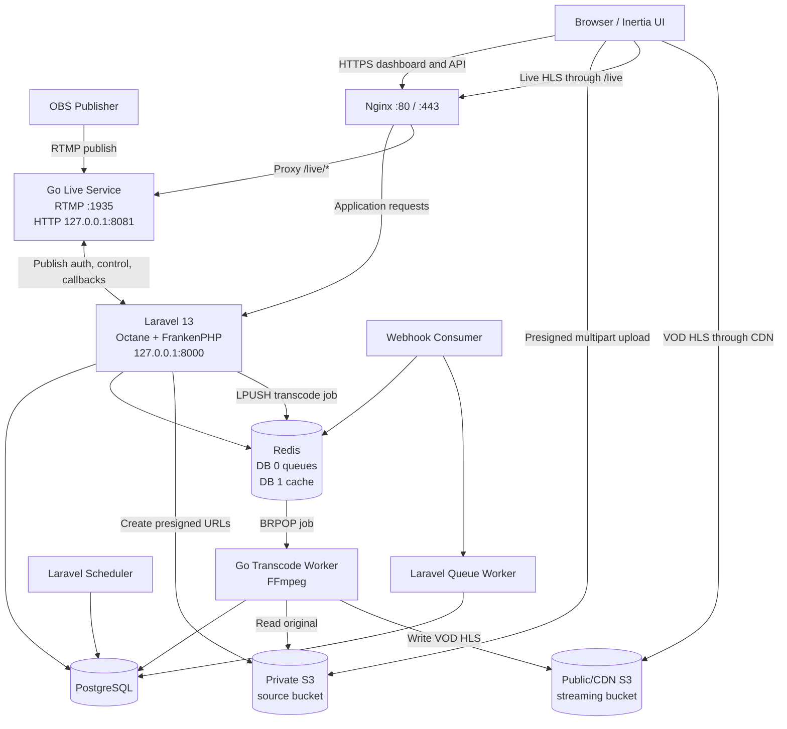

# Oxygen Setup Guide for Ubuntu Server

This guide installs and runs the complete Oxygen system on one terminal-only Ubuntu server:

- Laravel 13 with Octane and FrankenPHP
- React/Inertia production assets
- PostgreSQL and Redis
- Laravel queue and webhook workers
- Go live service for RTMP ingest and live HLS
- Go transcode worker with FFmpeg
- Nginx and HTTPS

The commands target **Ubuntu 24.04 LTS**. Run them from an account with `sudo` access. Replace every value written as `<LIKE_THIS>` before starting production.

## System architecture



Only ports `22`, `80`, `443`, and `1935` should be public. Laravel `8000`, Go live HTTP `8081`, PostgreSQL `5432`, and Redis `6379` remain private on `127.0.0.1`.

## 1. Prepare DNS and storage

Before installing the application:

1. Point `<APP_DOMAIN>` (for example, `video.example.com`) to the server's public IP address.
2. Create a **private source bucket** for uploaded originals.
3. Create a **streaming bucket** for transcoded HLS output.
4. Put a CDN in front of the streaming bucket, or otherwise make the HLS objects readable by viewers.
5. Create an IAM user or role with read/write access to both buckets.

The source bucket needs CORS because browsers upload directly to S3. Use a rule like this, replacing the domain:

```json
[
    {
        "AllowedOrigins": ["https://<APP_DOMAIN>"],
        "AllowedMethods": ["GET", "PUT", "POST"],
        "AllowedHeaders": ["*"],
        "ExposeHeaders": ["ETag"],
        "MaxAgeSeconds": 3600
    }
]
```

Keep the source bucket private. Apply a long cache lifetime to the immutable `.ts` files in the streaming bucket or CDN.

## 2. Update Ubuntu and install base packages

```bash
sudo apt update
sudo apt upgrade -y
sudo apt install -y \
    ca-certificates curl unzip git software-properties-common \
    nginx postgresql postgresql-contrib redis-server ffmpeg \
    build-essential pkg-config logrotate certbot python3-certbot-nginx
```

Enable the local services:

```bash
sudo systemctl enable --now postgresql redis-server nginx
```

## 3. Install PHP 8.4 and Composer

Ubuntu 24.04 does not provide PHP 8.4 in its default repository, so add the maintained PHP repository:

```bash
sudo add-apt-repository ppa:ondrej/php -y
sudo apt update
sudo apt install -y \
    php8.4-cli php8.4-common php8.4-curl php8.4-mbstring \
    php8.4-pgsql php8.4-redis php8.4-xml php8.4-zip \
    php8.4-bcmath php8.4-intl php8.4-gd
php -v
```

Install Composer using its verified installer:

```bash
cd /tmp
EXPECTED_CHECKSUM="$(curl -s https://composer.github.io/installer.sig)"
php -r "copy('https://getcomposer.org/installer', 'composer-setup.php');"
ACTUAL_CHECKSUM="$(php -r "echo hash_file('sha384', 'composer-setup.php');")"
test "$EXPECTED_CHECKSUM" = "$ACTUAL_CHECKSUM"
sudo php composer-setup.php --install-dir=/usr/local/bin --filename=composer
rm composer-setup.php
composer --version
```

If the checksum command fails, stop. Do not run the downloaded installer.

## 4. Install Node.js

Vite 8 needs a current Node.js release. Install Node.js 22 LTS:

```bash
curl -fsSL https://deb.nodesource.com/setup_22.x -o /tmp/nodesource_setup.sh
sudo -E bash /tmp/nodesource_setup.sh
sudo apt install -y nodejs
rm /tmp/nodesource_setup.sh
node --version
npm --version
```

Node.js is only required to build frontend assets; it does not need to run after deployment.

## 5. Install Go 1.25.1

Both `go.mod` files require Go 1.25.1 or newer. Install the official Go binary for the server architecture. Do not use Go 1.25.0: it may refuse the build or attempt an automatic toolchain download, which is unsuitable for a locked-down production server.

```bash
cd /tmp
GO_VERSION=1.25.1
ARCH="$(dpkg --print-architecture)"
test "$ARCH" = "amd64" -o "$ARCH" = "arm64"
curl -LO "https://go.dev/dl/go${GO_VERSION}.linux-${ARCH}.tar.gz"
sudo rm -rf /usr/local/go
sudo tar -C /usr/local -xzf "go${GO_VERSION}.linux-${ARCH}.tar.gz"
sudo ln -sf /usr/local/go/bin/go /usr/local/bin/go
go version
```

The `test` command intentionally stops unsupported architectures. Use the matching archive from `go.dev/dl` in that case.

## 6. Create the database and application user

Choose a strong database password and replace `<DB_PASSWORD>` below:

```bash
sudo -u postgres psql <<'SQL'
CREATE USER oxygen WITH PASSWORD '<DB_PASSWORD>';
CREATE DATABASE oxygen OWNER oxygen;
SQL
```

Create a non-login Linux service account and application directory:

```bash
sudo adduser --system --group --home /var/www/oxygen oxygen
sudo mkdir -p /var/www/oxygen
sudo chown -R oxygen:oxygen /var/www/oxygen
```

## 7. Download the application

Clone the repository. Use a deploy key if the repository is private.

```bash
sudo -u oxygen git clone <REPOSITORY_URL> /var/www/oxygen
cd /var/www/oxygen
```

If the code was uploaded by another method, make sure it is owned by the service account:

```bash
sudo chown -R oxygen:oxygen /var/www/oxygen
```

## 8. Install and configure Laravel

Install production dependencies and build the frontend:

```bash
cd /var/www/oxygen
sudo -u oxygen composer install --no-dev --prefer-dist --optimize-autoloader --no-interaction
sudo -u oxygen npm ci
sudo -u oxygen npm run build
sudo -u oxygen cp .env.example .env
```

Edit `/var/www/oxygen/.env`:

```bash
sudo -u oxygen nano /var/www/oxygen/.env
```

Use this production configuration as a starting point:

```dotenv
APP_NAME=Oxygen
APP_ENV=production
APP_KEY=
APP_DEBUG=false
APP_URL=https://<APP_DOMAIN>
ALLOW_REGISTER=false

LOG_CHANNEL=stack
LOG_LEVEL=info

DB_CONNECTION=pgsql
DB_HOST=127.0.0.1
DB_PORT=5432
DB_DATABASE=oxygen
DB_USERNAME=oxygen
DB_PASSWORD=<DB_PASSWORD>
DB_SSLMODE=prefer

SESSION_DRIVER=database
QUEUE_CONNECTION=database
CACHE_STORE=redis

REDIS_CLIENT=phpredis
REDIS_HOST=127.0.0.1
REDIS_PASSWORD=null
REDIS_PORT=6379
REDIS_DB=0
REDIS_CACHE_DB=1

FILESYSTEM_DISK=s3
AWS_ACCESS_KEY_ID=<AWS_ACCESS_KEY>
AWS_SECRET_ACCESS_KEY=<AWS_SECRET_KEY>
AWS_DEFAULT_REGION=<AWS_REGION>
AWS_BUCKET=<SOURCE_BUCKET>
AWS_URL=
AWS_ENDPOINT=
AWS_USE_PATH_STYLE_ENDPOINT=false

TRANSCODE_QUEUE_KEY=queues:transcode
TRANSCODE_WEBHOOK_QUEUE_KEY=queues:transcode:webhooks

LIVE_RTMP_URL=rtmp://<APP_DOMAIN>:1935/live
LIVE_HLS_URL=https://<APP_DOMAIN>/live
LIVE_SERVICE_TOKEN=<LONG_RANDOM_SERVICE_TOKEN>
LIVE_CONTROL_URL=http://127.0.0.1:8081
LIVE_CONTROL_TOKEN=<LONG_RANDOM_CONTROL_TOKEN>

MAIL_MAILER=log
```

Generate the two live tokens from the terminal:

```bash
openssl rand -hex 32
openssl rand -hex 32
```

Use a different output for each token. Then generate the Laravel key, migrate, link public storage, and cache production configuration:

```bash
cd /var/www/oxygen
sudo -u oxygen php artisan key:generate --force
sudo -u oxygen php artisan migrate --force
sudo -u oxygen php artisan storage:link
sudo -u oxygen php artisan optimize
sudo chown -R oxygen:oxygen storage bootstrap/cache
sudo chmod -R ug+rwX storage bootstrap/cache
sudo chmod 640 .env
```

Install the FrankenPHP binary used by Octane:

```bash
cd /var/www/oxygen
sudo -u oxygen php artisan octane:install --server=frankenphp --no-interaction
```

The `php8.4-*` packages installed earlier provide extensions to the CLI used by Artisan. FrankenPHP has its own embedded PHP runtime, so verify its modules separately:

```bash
cd /var/www/oxygen
sudo -u oxygen ./frankenphp php-cli -m | grep -E 'pdo_pgsql|redis'
```

The output must contain both `pdo_pgsql` and `redis`. Do not start Octane if either module is absent; replace or rebuild the FrankenPHP binary with both extensions included.

## 9. Configure and build the Go transcode worker

The Go worker must use the same PostgreSQL, Redis, and S3 infrastructure as Laravel.

```bash
cd /var/www/oxygen/golang-queue
sudo -u oxygen cp .env.example .env
sudo -u oxygen nano .env
```

Set the following values:

```dotenv
REDIS_ADDR=127.0.0.1:6379
REDIS_PASSWORD=
REDIS_DB=0
QUEUE_KEY=oxygen-database-queues:transcode

WORKER_CONCURRENCY=1
WORK_DIR=/var/lib/oxygen-transcode

DATABASE_URL=postgres://oxygen:<DB_PASSWORD>@127.0.0.1:5432/oxygen?sslmode=disable

AWS_DEFAULT_REGION=<AWS_REGION>
AWS_ACCESS_KEY_ID=<AWS_ACCESS_KEY>
AWS_SECRET_ACCESS_KEY=<AWS_SECRET_KEY>

SOURCE_AWS_BUCKET=<SOURCE_BUCKET>
SOURCE_AWS_ENDPOINT=
SOURCE_AWS_URL=
SOURCE_AWS_USE_PATH_STYLE_ENDPOINT=false

STREAMING_AWS_BUCKET=<STREAMING_BUCKET>
STREAMING_AWS_ENDPOINT=
STREAMING_AWS_URL=https://<CDN_OR_STREAMING_BUCKET_DOMAIN>
STREAMING_AWS_USE_PATH_STYLE_ENDPOINT=false
STREAMING_AWS_DEFAULT_REGION=<AWS_REGION>

FFMPEG_BIN=/usr/bin/ffmpeg
FFPROBE_BIN=/usr/bin/ffprobe
FFMPEG_VIDEO_CODEC=libx264
PROGRESS_MIN_INTERVAL_MS=2000
HLS_PREFIX=hls
```

`QUEUE_KEY` includes Laravel's Redis prefix. With `APP_NAME=Oxygen`, the full key is `oxygen-database-queues:transcode`. If `APP_NAME` or `REDIS_PREFIX` changes, update `QUEUE_KEY` too.

Build the worker and prepare its scratch directory:

```bash
cd /var/www/oxygen/golang-queue
sudo -u oxygen mkdir -p bin
sudo -u oxygen go build -o bin/worker ./cmd/worker
sudo mkdir -p /var/lib/oxygen-transcode
sudo chown -R oxygen:oxygen /var/lib/oxygen-transcode
sudo chmod 640 .env
```

Confirm FFmpeg is available:

```bash
ffmpeg -version
ffprobe -version
```

## 10. Configure and build the Go live service

Create durable directories for live HLS and callback recovery:

```bash
sudo mkdir -p /var/lib/oxygen-live/hls /var/lib/oxygen-live/callbacks
sudo chown -R oxygen:oxygen /var/lib/oxygen-live
```

Configure the service:

```bash
cd /var/www/oxygen/golang-live
sudo -u oxygen cp .env.example .env
sudo -u oxygen nano .env
```

Use the same live tokens that were placed in Laravel's `.env`:

```dotenv
LIVE_ADDR=127.0.0.1:8081
LIVE_RTMP_ADDR=:1935
LIVE_HLS_ROOT=/var/lib/oxygen-live/hls
LIVE_CALLBACK_ROOT=/var/lib/oxygen-live/callbacks
LARAVEL_URL=http://127.0.0.1:8000
LIVE_SERVICE_TOKEN=<SAME_LONG_RANDOM_SERVICE_TOKEN>
LIVE_CONTROL_TOKEN=<SAME_LONG_RANDOM_CONTROL_TOKEN>
LIVE_ALLOW_INSECURE_CONTROL=false
LIVE_TRUST_PROXY_HEADERS=true
MAX_TRACKED_VIEWERS=100000
MAX_RTMP_CONNECTIONS=1000
MAX_LIVE_TRANSCODERS=2
FFMPEG_RELAY_WRITE_TIMEOUT_SECONDS=10
FFMPEG_OUTPUT_STALL_TIMEOUT_SECONDS=10
VIEWER_TTL_SECONDS=45
ROLLUP_INTERVAL_SECONDS=15
```

`LIVE_TRUST_PROXY_HEADERS=true` is safe here only because port `8081` is bound to localhost and Nginx replaces the forwarding headers.

The live service loads `golang-live/.env` first and then silently fills missing keys from Laravel's parent `.env`. Keep every live-service setting explicit here—especially `LIVE_HLS_ROOT=/var/lib/oxygen-live/hls`—or an omitted value may fall back to Laravel's `/tmp/oxygen-live/hls` setting and be erased on reboot.

Build the service:

```bash
cd /var/www/oxygen/golang-live
sudo -u oxygen mkdir -p bin
sudo -u oxygen go build -o bin/live ./cmd/live
sudo chmod 640 .env
```

## 11. Create systemd services

### Laravel Octane

Create `/etc/systemd/system/oxygen-octane.service`:

```ini
[Unit]
Description=Oxygen Laravel Octane
After=network.target postgresql.service redis-server.service
Requires=postgresql.service redis-server.service

[Service]
Type=simple
User=oxygen
Group=oxygen
WorkingDirectory=/var/www/oxygen
Environment=HOME=/var/www/oxygen
ExecStart=/usr/bin/php artisan octane:start --server=frankenphp --host=127.0.0.1 --port=8000 --max-requests=500
ExecReload=/usr/bin/php artisan octane:reload
Restart=always
RestartSec=5
KillSignal=SIGTERM
TimeoutStopSec=3600
StandardOutput=append:/var/www/oxygen/storage/logs/octane.log
StandardError=append:/var/www/oxygen/storage/logs/octane.log

[Install]
WantedBy=multi-user.target
```

### Laravel queue worker

Create `/etc/systemd/system/oxygen-queue.service`:

```ini
[Unit]
Description=Oxygen Laravel Queue Worker
After=network.target postgresql.service redis-server.service

[Service]
Type=simple
User=oxygen
Group=oxygen
WorkingDirectory=/var/www/oxygen
ExecStart=/usr/bin/php artisan queue:work --sleep=3 --tries=3 --timeout=60
Restart=always
RestartSec=5
TimeoutStopSec=3600

[Install]
WantedBy=multi-user.target
```

### Webhook consumer

Create `/etc/systemd/system/oxygen-webhooks.service`:

```ini
[Unit]
Description=Oxygen Webhook Consumer
After=network.target redis-server.service

[Service]
Type=simple
User=oxygen
Group=oxygen
WorkingDirectory=/var/www/oxygen
ExecStart=/usr/bin/php artisan webhooks:consume --timeout=30
Restart=always
RestartSec=5

[Install]
WantedBy=multi-user.target
```

### Go transcode worker

Create `/etc/systemd/system/oxygen-transcode.service`:

```ini
[Unit]
Description=Oxygen Go Transcode Worker
After=network.target postgresql.service redis-server.service

[Service]
Type=simple
User=oxygen
Group=oxygen
WorkingDirectory=/var/www/oxygen/golang-queue
ExecStart=/var/www/oxygen/golang-queue/bin/worker
Restart=always
RestartSec=5
TimeoutStopSec=3600

[Install]
WantedBy=multi-user.target
```

### Go live service

Create `/etc/systemd/system/oxygen-live.service`:

```ini
[Unit]
Description=Oxygen Go Live Streaming Service
After=network.target oxygen-octane.service
Requires=oxygen-octane.service

[Service]
Type=simple
User=oxygen
Group=oxygen
WorkingDirectory=/var/www/oxygen/golang-live
ExecStart=/var/www/oxygen/golang-live/bin/live
Restart=always
RestartSec=5
KillSignal=SIGTERM
TimeoutStopSec=120

[Install]
WantedBy=multi-user.target
```

Reload systemd and start everything:

```bash
sudo systemctl daemon-reload
sudo systemctl enable --now \
    oxygen-octane oxygen-queue oxygen-webhooks \
    oxygen-transcode oxygen-live
```

Check the services:

```bash
sudo systemctl status oxygen-octane --no-pager
sudo systemctl status oxygen-queue --no-pager
sudo systemctl status oxygen-webhooks --no-pager
sudo systemctl status oxygen-transcode --no-pager
sudo systemctl status oxygen-live --no-pager
```

### Rotate the Octane log

The Octane service writes directly to `storage/logs/octane.log`, so configure log rotation to prevent unbounded disk growth. Create `/etc/logrotate.d/oxygen-octane`:

```text
/var/www/oxygen/storage/logs/octane.log {
    daily
    rotate 14
    compress
    delaycompress
    missingok
    notifempty
    copytruncate
    su oxygen oxygen
}
```

Validate the configuration:

```bash
sudo logrotate --debug /etc/logrotate.d/oxygen-octane
```

## 12. Configure the Laravel scheduler

Only one scheduler should run. Create `/etc/cron.d/oxygen`:

```cron
* * * * * oxygen cd /var/www/oxygen && /usr/bin/php artisan schedule:run >> /dev/null 2>&1

```

The file must end with a newline. After entering the cron line, press Enter once before saving it; cron may ignore an unterminated final line.

Set the required permissions:

```bash
sudo chown root:root /etc/cron.d/oxygen
sudo chmod 644 /etc/cron.d/oxygen
```

### Prune old live HLS files

Completed live sessions leave HLS playlists and segments under `LIVE_HLS_ROOT`. Add a cron job or systemd timer that removes directories only after the corresponding live session has ended and your retention period has passed. Do not blindly delete the whole HLS root because active broadcasts write there. For example, after confirming there are no active sessions in directories older than 24 hours, the filesystem portion of a cleanup can use:

```bash
find /var/lib/oxygen-live/hls -mindepth 1 -maxdepth 1 -type d -mmin +1440 -exec rm -rf -- {} +
```

Automate this only with an active-session check appropriate to the deployment.

## 13. Configure Nginx

Create `/etc/nginx/sites-available/oxygen`:

```nginx
map $http_upgrade $connection_upgrade {
    default upgrade;
    '' close;
}

server {
    listen 80;
    listen [::]:80;
    server_name <APP_DOMAIN>;

    root /var/www/oxygen/public;
    index index.php;
    charset utf-8;
    client_max_body_size 20m;

    location ^~ /live/ {
        proxy_http_version 1.1;
        proxy_set_header Host $host;
        proxy_set_header X-Real-IP $remote_addr;
        proxy_set_header X-Forwarded-For $remote_addr;
        proxy_set_header X-Forwarded-Proto $scheme;
        proxy_buffering off;
        proxy_pass http://127.0.0.1:8081;
    }

    location /index.php {
        try_files /not_exists @octane;
    }

    location / {
        try_files $uri $uri/ @octane;
    }

    location = /favicon.ico { access_log off; log_not_found off; }
    location = /robots.txt  { access_log off; log_not_found off; }

    location ~ /\.(?!well-known).* {
        deny all;
    }

    location @octane {
        proxy_http_version 1.1;
        proxy_set_header Host $http_host;
        proxy_set_header Scheme $scheme;
        proxy_set_header SERVER_PORT $server_port;
        proxy_set_header REMOTE_ADDR $remote_addr;
        proxy_set_header X-Forwarded-For $proxy_add_x_forwarded_for;
        proxy_set_header X-Forwarded-Proto $scheme;
        proxy_set_header Upgrade $http_upgrade;
        proxy_set_header Connection $connection_upgrade;
        proxy_pass http://127.0.0.1:8000;
    }

    access_log /var/log/nginx/oxygen-access.log;
    error_log /var/log/nginx/oxygen-error.log;
}
```

Enable the site and validate Nginx:

```bash
sudo ln -s /etc/nginx/sites-available/oxygen /etc/nginx/sites-enabled/oxygen
sudo rm -f /etc/nginx/sites-enabled/default
sudo nginx -t
sudo systemctl reload nginx
```

Once DNS resolves to this server, obtain the HTTPS certificate:

```bash
sudo certbot --nginx -d <APP_DOMAIN>
sudo certbot renew --dry-run
```

## 14. Configure the firewall

Open SSH, HTTP, HTTPS, and RTMP only:

```bash
sudo ufw allow OpenSSH
sudo ufw allow 'Nginx Full'
sudo ufw allow 1935/tcp
sudo ufw enable
sudo ufw status
```

Do not open ports `5432`, `6379`, `8000`, or `8081` to the internet.

## 15. Verify the full system

Check listening ports:

```bash
sudo ss -lntp
```

Check Laravel and the live service locally:

```bash
curl -I -H 'Host: <APP_DOMAIN>' http://127.0.0.1:8000
curl http://127.0.0.1:8081/healthz
curl http://127.0.0.1:8081/readyz
curl -I https://<APP_DOMAIN>
```

Inspect logs if a service is not healthy:

```bash
sudo journalctl -u oxygen-octane -n 100 --no-pager
sudo journalctl -u oxygen-queue -n 100 --no-pager
sudo journalctl -u oxygen-webhooks -n 100 --no-pager
sudo journalctl -u oxygen-transcode -n 100 --no-pager
sudo journalctl -u oxygen-live -n 100 --no-pager
```

Verify the Redis transcode queue name:

```bash
redis-cli LLEN oxygen-database-queues:transcode
```

### Test VOD transcoding

1. Temporarily set `ALLOW_REGISTER=true`, or create the first user through an approved administrative process.
2. Sign in and create a transcoding profile.
3. Upload a video from the **Manage** page.
4. Watch the worker with `sudo journalctl -u oxygen-transcode -f`.
5. Confirm the media status changes from `uploaded` to `progress` to `success`.
6. Confirm `main.m3u8` and rendition segments appear in the streaming bucket.

### Test live streaming

1. Create a live stream in the Oxygen admin UI.
2. In OBS, set the server to `rtmp://<APP_DOMAIN>:1935/live`.
3. Set the stream key to `{public_id}?key={stream_key}` from the live stream page.
4. Set the OBS keyframe interval to `2` seconds and use CBR.
5. Start streaming and watch `sudo journalctl -u oxygen-live -f`.
6. Open the live stream page and verify HLS playback.

## 16. Deploy updates

Run the following after pulling a new release:

```bash
cd /var/www/oxygen
sudo -u oxygen git pull --ff-only
sudo -u oxygen composer install --no-dev --prefer-dist --optimize-autoloader --no-interaction
sudo -u oxygen npm ci
sudo -u oxygen npm run build
sudo -u oxygen php artisan migrate --force
sudo -u oxygen php artisan optimize

cd /var/www/oxygen/golang-queue
sudo -u oxygen go build -o bin/worker ./cmd/worker

cd /var/www/oxygen/golang-live
sudo -u oxygen go build -o bin/live ./cmd/live

sudo systemctl restart oxygen-transcode oxygen-live
sudo -u oxygen php /var/www/oxygen/artisan queue:restart
sudo systemctl reload oxygen-octane
```

If `octane:reload` cannot reload cleanly after a dependency change, restart it:

```bash
sudo systemctl restart oxygen-octane oxygen-queue oxygen-webhooks
```

## Common problems

### Transcode jobs remain queued

- Confirm `oxygen-transcode` is running.
- Confirm Laravel and Go use Redis DB `0`.
- Confirm `QUEUE_KEY=oxygen-database-queues:transcode`.
- Check `redis-cli LLEN oxygen-database-queues:transcode`.
- Check the Go worker journal for database, S3, or FFmpeg errors.

### Uploads fail in the browser

- Verify source-bucket CORS includes the exact `APP_URL` origin.
- Make sure `ETag` is exposed by CORS.
- Confirm the IAM credentials can create, upload, complete, and abort multipart uploads.
- Do not make the source bucket public.

### Live service is healthy but not ready

- Confirm Laravel is reachable at `http://127.0.0.1:8000`.
- Confirm both `LIVE_SERVICE_TOKEN` values are identical.
- Confirm `/var/lib/oxygen-live/callbacks` is writable by `oxygen`.
- Read `journalctl -u oxygen-live` for recovery errors.

### OBS cannot connect

- Confirm TCP port `1935` is open in UFW and the cloud provider firewall.
- Confirm `oxygen-live` listens on `0.0.0.0:1935` with `ss -lntp`.
- Use the exact stream key format `{public_id}?key={stream_key}`.
- Confirm the Laravel and Go service tokens match.

### The UI still shows old frontend code

Rebuild assets and reload Octane:

```bash
cd /var/www/oxygen
sudo -u oxygen npm run build
sudo systemctl reload oxygen-octane
```
